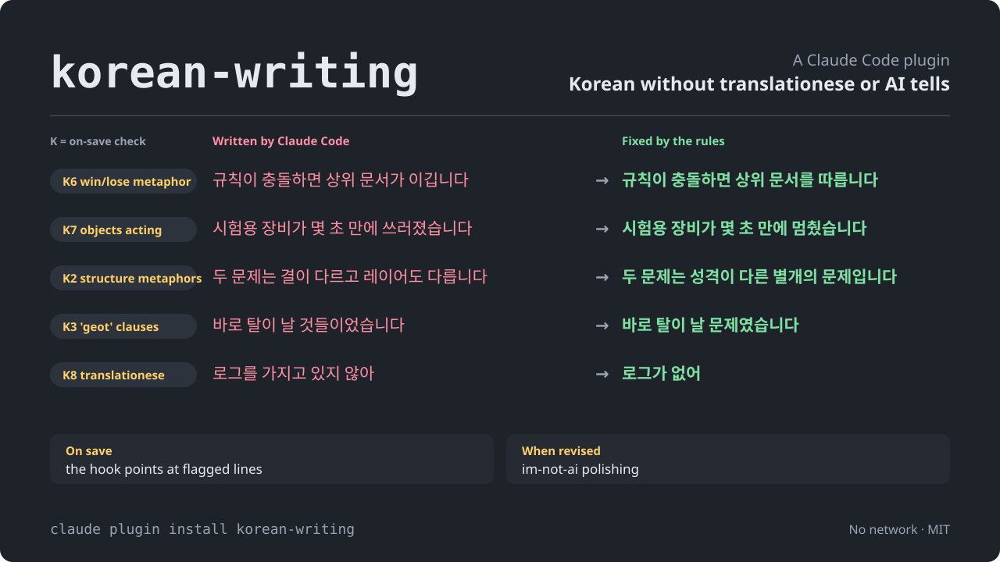

<picture>
  <source media="(prefers-color-scheme: dark)" srcset="docs/hero.en.svg">
  <source media="(prefers-color-scheme: light)" srcset="docs/hero-light.en.svg">
  
</picture>

<p align="center">
  <a href="README.md">한국어</a> · <strong>English</strong>
</p>

<p align="center">
  <strong>A Claude Code plugin that makes Claude write Korean without translationese or AI tells.</strong><br>
  New text follows the rules from the first line. When a <code>.md</code> is saved, AI tells are flagged and handed back to Claude in the same turn.<br>
  Text that already exists keeps its facts and has only its style fixed.<br>
  Two commands to install, nothing to configure. Nothing you write leaves your machine.
</p>

<p align="center">
  <a href="https://github.com/IsthisLee/korean-writing/actions/workflows/validate.yml"></a>
  <a href="https://github.com/IsthisLee/korean-writing/actions/workflows/codeql.yml"></a>
  <a href="https://scorecard.dev/viewer/?uri=github.com/IsthisLee/korean-writing"></a>
  
  
  
  
  
  <a href="https://github.com/IsthisLee/korean-writing/commits/main"></a>
</p>

<p align="center">
  <a href="#overview">Introduction</a> ·
  <a href="#examples">Examples</a> ·
  <a href="#three-minutes-to-try-it">3-minute start</a> ·
  <a href="#install">Install</a> ·
  <a href="#usage">Usage</a> ·
  <a href="#components">Components</a> ·
  <a href="#the-verdict-rules">Verdict rules</a> ·
  <a href="#verification">Verification</a> ·
  <a href="#how-it-differs-from-other-tools">Compared with other tools</a> ·
  <a href="#faq">FAQ</a>
</p>

> **v2.1.0**: Claude now asks in Korean whether to apply the skill instead of raising a permission prompt, and choosing not to apply no longer stops the work. The tagline changed, and the README gained a before/after comparison and a guide to getting the best text. Details: [CHANGELOG.md](CHANGELOG.md)

## Overview

Claude Code's Korean is grammatically fine. It still reads wrong: word order carried over from English, metaphors that arrived through English, and stock phrases that land in the same spot of every document. When 205 Korean documents that had accumulated on one machine were run through the hook, 85 were flagged and only one of those was written before 2024. The rest are 2026 files written by Claude, most of them for em-dash interjections.

Patching this with a prompt means pasting that prompt into every session, and asking for a cleanup afterwards is already too late: polishing a finished draft changes little. When drafts were polished in our tests, at most 18% of the text changed, and one notice did not change at all. Across 14 pairs of the same request, three AI judges who were not told which text was which all picked the one written under the rules from the start more often. In the primary run, though, half the pairs flipped when the order was swapped, so this does not settle the question (see Verification). So the three moments when Korean text gets made each get an owner. Installing turns on all three at once, and there is nothing to remember to call.

| Moment                                                        | What covers it                                                                                           | When it runs                             | Where the rules live                     |
| ------------------------------------------------------------- | -------------------------------------------------------------------------------------------------------- | ---------------------------------------- | ---------------------------------------- |
| **When first written**<br>Slack, mail, reports, READMEs | The `korean-writing` skill writes to the rules from the first line; you are asked first when Claude calls it on its own                                       | When you ask for text                    | `plugin/SKILL.md`                        |
| **On save**<br>anything that lands as `.md`                   | A PostToolUse hook checks what was just written and hands the findings back to Claude in the same turn   | Right after `Edit`, `Write`, `MultiEdit` | `plugin/hooks-handlers/posttooluse.sh`   |
| **When revised**<br>someone else's draft, an old document | The polishing pipeline fixes the style and leaves the facts alone                                        | When you ask for a touch-up              | `plugin/skills/humanize-korean/SKILL.md` |

One more skill sits alongside: character counts come from a script rather than the model's guess.

The codes in the top image — `K6`, `K7` and the rest — name the ten patterns the on-save hook looks for; all ten are listed under Rules. The three moments do not share one list. The skill used when text is first written follows a wider set of writing rules, and the polishing used when text is revised uses im-not-ai's own taxonomy. The ten are the subset that a regular expression can catch without flagging sentences that are fine.

The check runs when a `.md` file is saved. First draft or later fix, every time the file is touched it looks at what was just written. It does not run on text that only appears in chat, and it does not run while the skill is writing to the rules.

> Think of a linter, attached to Korean prose instead of code. The findings reach Claude within the same turn, so they get fixed before you read the file. In three measured runs that asked Claude to save a draft full of AI tells, Claude saved it first and then fixed every flagged item in the same turn, every time. Without the plugin, all three runs saved the draft as it was ([experiment](./docs/experiments/hook-loop/)).

## Examples

### Same request, two results

<p align="center"></p>

One column, written two ways. Opening lines sit next to opening lines, closing lines next to closing lines. On the left, a column written without the rules and then polished by im-not-ai; the first/next/finally sequence and the aphoristic closing line survived the polish. On the right, the same request written with the `korean-writing` skill from the start. An AI judge, not told which was which, was asked twice (the second time with the order swapped) and picked it both times; the phrases marked as pointed at by the judge are quoted from that verdict. This is one example; the full comparison is in the Verification section. The full texts are in `docs/samples/before-after/`, and `tools/render-before-after.py` draws the image.

### Sentences, before and after

Four sentences from the ground truth show what the rules are after, before and after. Every "before" was actually written by Claude Code; every "after" is the same sentence fixed by this repository's rules.

| Before (as Claude Code wrote it)                                                                                | After (fixed by the rules)                                                                             | What was wrong                                                                                                                  |
| --------------------------------------------------------------------------------------------------------------- | ------------------------------------------------------------------------------------------------------ | ------------------------------------------------------------------------------------------------------------------------------- |
| 규칙이 충돌하면 상위 문서가 **이깁니다**. 둘 다 값이 있을 때는 텍스트가 **이기고** 강의실 참조는 무시됩니다.    | 규칙이 충돌하면 상위 문서를 따릅니다. 둘 다 값이 있을 때는 텍스트가 우선하고 강의실 참조는 무시됩니다. | "The upper document wins": documents and settings made to compete like people. D-5 in im-not-ai's taxonomy                      |
| 원인은 힙 부족이 아니었습니다 **—** 실측해보니 **—** 설정이 아예 먹히지 않았습니다.                             | 원인은 힙 부족이 아니었습니다. 실측해 보니 설정이 아예 먹히지 않았습니다.                              | An em-dash interjection, English punctuation copied into Korean. 74 of the 85 flagged files hit this |
| 여기서 갈리는 **축은** 프로젝트 전용 여부가 아니라 성격입니다. 두 문제는 **결이** 다르고 **레이어도** 다릅니다. | 여기서 갈리는 기준은 프로젝트 전용 여부가 아니라 성격입니다. 두 문제는 성격이 다른 별개의 문제입니다.  | "Axis," "grain," "layer": structure described through metaphor                                                                  |
| 시험용 장비가 몇 초 만에 **쓰러졌습니다**. **일으켜 세우면** 또 쓰러지기를 스무 분 넘게 반복했습니다.           | 시험용 장비가 몇 초 만에 멈췄습니다. 다시 켜면 또 멈추기를 스무 분 넘게 반복했습니다.                  | Equipment "falling over" and being "stood back up": an English metaphor translated literally                                    |

### What you see on save

This is what appears in Claude Code after a `.md` edit. The window frame is drawn; from the yellow line down it is the hook's actual output, unchanged. `tools/render-hook-output.py` draws it by feeding ground-truth sentences to the hook.

<p align="center"></p>

This is the exact stderr the hook produced when the win/lose sentence (G06) and the em-dash sentence (G07) from the ground truth were fed in as two paragraphs. Each flagged spot carries its line number and an excerpt, so Claude fixes only those spots.

```
[korean-writing] 배포-지연.md 에 AI 티 패턴이 있다. 편집은 그대로 두었으니 확인하고 고쳐라.
  K1  줄표(—) 삽입구 4개 — 쉼표나 문장 분리로 바꾼다. 한국어에서 가장 강한 AI 티다
      3행 「원인은 힙 부족이 아니었습니다 — 실측해보니 — 설정이 아예 먹히지…」
      3행 「…그동안 엉뚱한 데를 뒤졌고 — 그게 시간을 더 잡아먹었습니다 — 결국 다시 봐야 했습니다.」
  K6  승패 의인화 2회 — 우선한다·따른다·앞선다 로 직결한다
      1행 「규칙이 충돌하면 상위 문서가 이깁니다. 둘 다 값이 있을 때는…」
      1행 「…다 값이 있을 때는 텍스트가 이기고 강의실 참조는 무시됩니다.…」
  걸린 표현만 고친다. 수치·개수·조건·유보 표현과 걸리지 않은 문장은 그대로 둔다.
  교정 규칙은 korean-writing 스킬에 있다. 격식 문서(계약·약관·법률)면 파일 머리에 <!-- korean-writing: ignore --> 를 넣으면 다시 알리지 않는다.
```

This output goes back to Claude too. Claude Code shows the stderr of a PostToolUse hook that exits 2 to Claude in the same turn, and in [the experiment](./docs/experiments/hook-loop/) Claude fixed every flagged item within that turn.

## Three minutes to try it

1. Install. Two commands, nothing to configure.
   ```bash
   claude plugin marketplace add IsthisLee/korean-writing
   claude plugin install korean-writing
   ```
2. Open a new session and ask for any piece of text. A prompt asks whether to apply the `korean-writing` rules; allow it and the text follows them.
   ```
   운영팀에 보낼 옵션 변경 안내문 써줘. 슬랙에 캐주얼하게.
   ```
3. Ask to save that text as a `.md` file. The hook checks what was just written and, if anything is flagged, prints output like the one above, and Claude fixes it on the spot. If nothing is flagged, it stays silent.

## Install

```bash
claude plugin marketplace add IsthisLee/korean-writing
claude plugin install korean-writing
```

When `claude plugin list` shows `korean-writing` as `enabled`, you are done. New versions come with `claude plugin update korean-writing`. A local checkout can be registered as a marketplace too, for an internal copy or a fork.

```bash
claude plugin marketplace add /path/to/korean-writing
claude plugin install korean-writing
```

| Needed      | Used by                                                                                      | Without it                                                          |
| ----------- | -------------------------------------------------------------------------------------------- | ------------------------------------------------------------------- |
| Claude Code | Everything. Verified on 2.1.267                                                              |                                                                     |
| `bash`      | Both hooks and the scripts                                                                 | The hooks do not run                                                |
| `python3`   | Both hooks and the polishing pipeline's scripts; polishing needs 3.10 or newer | The check passes without checking and the skill loads without asking; the polishing scripts do not run |
| `node` 18+  | The character-count script                                                                   | Only that skill is unavailable                                      |

There are no packages to download. CI runs the same checks on macOS and Linux, and Windows needs Git Bash or WSL and has not been tried yet.

### Outside Claude Code

The writing rules and the character-count skill follow the [Agent Skills](https://agentskills.io/specification) format, so they also install into other agents such as Codex, Cursor and Gemini CLI. The [Skills CLI](https://skills.sh) finds them in the repository.

```bash
npx skills add IsthisLee/korean-writing -s korean-writing -s korean-character-count -g
```

The two hooks and the polishing pipeline run only in Claude Code: the hooks attach to Claude Code's hook events, and polishing calls Claude Code subagents. Other agents get the writing rules and the character count, nothing more. On 2026-09-11 both skills were installed for Codex and Cursor into an isolated HOME; their files landed and the character-count script ran from where it was installed. Whether each agent then loads the skills was not checked. The `korean-writing` skill uses the whole plugin folder as its skill folder, so the hook and polishing files are copied along; other agents do not use them.

## Usage

Talk to Claude Code as usual; the skills load from the request, and `korean-writing` asks before it applies. These lines can be pasted as they are.

```
운영팀에 보낼 옵션 변경 안내문 써줘. 슬랙에 캐주얼하게.      (a casual Slack notice to the ops team about the option change)
아래 글 번역투만 고쳐줘. 사실과 숫자는 그대로 두고.           (fix only the translation-ese below; keep facts and numbers)
이 자기소개서 공백 포함 몇 자야? 1,000자 제한이야.            (how many characters including spaces? the limit is 1,000)
이 프로젝트 README 써줘. 오픈소스용으로.                       (write a README for this project, open-source style)
이번 배포 QA 보고서를 배포-QA.md 로 써줘.                       (write this release's QA report to 배포-QA.md)
```

Here is what loads on its own, when, and what to type to call it by name.

| What                             | Runs on its own when                                          | Direct call                                                      |
| -------------------------------- | ------------------------------------------------------------- | ---------------------------------------------------------------- |
| The `korean-writing` skill       | A writing request, after you confirm it                       | `/korean-writing`; typing it skips the question                  |
| Polishing                        | "AI 티 없애줘", "번역투 고쳐줘" and similar requests           | `/korean-writing:humanize [text or file path]`                   |
| A second polishing pass          | Never on its own; it has to be called by name                 | `/korean-writing:humanize-redo [instruction]`                    |
| The check hook                   | Right after `Edit`, `Write` or `MultiEdit` touches a `.md`    | `/korean-writing:check FILE...`                                   |
| Character counting               | "500자 이내로", "글자 수 세줘" and similar requests            | `/korean-writing:korean-character-count`                         |
| The output style                 | Every answer once you turn it on; off by default               | `/config` → Output style → `korean-writing`                      |

The two hooks have no name to call: they run when their condition is met and stay quiet otherwise. Three of the five skills load from the request; the two polishing entry points (`humanize`, `humanize-redo`) carry `disable-model-invocation`, so they only run when typed, and in exchange they cost nothing in always-on context. If you installed the plugin, `/korean-writing:korean-writing` reaches the same skill; the short form is fine. When Claude calls `korean-writing` on its own, it first asks in Korean whether to apply it; why is under "Why it asks before writing" below.

### Why it asks before writing

When Claude calls `korean-writing` on its own, it asks in Korean right before writing. It shows in one line what it is about to write and offers 「적용」 (apply), 「적용하고 설명은 넉넉히」 (apply, and keep the explanations generous) or 「적용 안 함」 (don't apply). Claude adds one sentence of its own opinion on whether the rules suit this piece and marks the option it recommends with 「(추천)」; the recommendation is a suggestion and the choice stays yours. Choosing not to apply does not stop the work; Claude carries on without the rules.

It asks because the rules make text shorter. Dates, numbers and conditions written into the request were never dropped in the measurement (27 items). What shrinks is the explanation Claude adds on its own. Asked for a document explaining debouncing, text written without the rules ran 661 Korean characters and all 8 runs explained that changing `delay` restarts the timer; with the rules it ran 461 characters and only 4 of 8 did ([`EVALUATION.md`](EVALUATION.md) J3, Korean). For a document that needs those side explanations, choose 「적용하고 설명은 넉넉히」. Whether that option actually changes the output was measured on the same task: with the rules alone 62 of 88 items survived, and with this option 72 of 88 did, matching the run with no rules at all, at 564 Korean characters. A permutation test puts the rules-alone condition significantly lower (p=0.014).

It asks once, right before writing, whether the text is a chat reply or a `.md` file. The check hook that runs on save never asks, but it does follow this answer: choose 「적용 안 함」 and the file you were writing gets no check notices either, so the plugin stops pushing rules you just turned down. Other documents are still checked, and choosing 「적용」 next time brings the check back with it. Typing `/korean-writing` yourself, or asking for it by name ("korean-writing 스킬로 써줘"), applies it without asking.

### Getting the best text

1. **Put the facts in the request.** Dates, numbers, conditions and the audience come through even with the rules on (J3).
2. **State the length if it matters.** Text written under the rules tends to come out shorter than asked (C10); ask for more if it falls short.
3. **Attach a sample of your own writing if you have a voice.** The skill follows the sample's endings and sentence length before its own rules. This has not been measured yet.
4. **Choose 「적용」 when asked.** For a document that is only useful with its side explanations, such as defaults and how something works, choose 「적용하고 설명은 넉넉히」. For a formal document whose wording must stay as written, choose 「적용 안 함」.
5. **Have it saved as a `.md` file.** The check hook hands back each flagged spot with its line number and Claude fixes it in the same turn ([experiment](./docs/experiments/hook-loop/)).
6. **Polish drafts that already exist with `/korean-writing:humanize`.** For new text, writing under the rules from the start works better than writing first and polishing afterwards: across 14 re-measured pairs every judge picked it more often, though the primary judgement fell short of the bar for naming a winner ([EVALUATION.md](EVALUATION.md) section L, in Korean).

Hand a draft to the polish skill and the fixed text comes back with a one-line status: an estimated change rate and a grade from A to D. Below it, three to six of the main edits are shown side by side, before and after. If more than half the text changed, you get that fact instead of a result. A text changed by half is a rewrite, not a polish.

To check existing documents, run `/korean-writing:check FILE...`. It applies the same rules as the hook, points at each flagged spot, and asks before changing anything. From a shell, `plugin/scripts/check.sh FILE...` exits 1 if any file is flagged, and `--all` covers every `.md` this repository wrote. Both work as-is in CI and pre-commit; `tools/install-git-hook.sh` installs the pre-commit hook for you.

It can be switched off at several scopes, and individual rules can be turned off on their own.

| Scope                | How                                                                                                                                 |
| -------------------- | ----------------------------------------------------------------------------------------------------------------------------------- |
| One file             | `<!-- korean-writing: ignore -->` at the top. For contracts, or a catalog of bad examples, where flagging every time makes no sense |
| Some rules in one file | `<!-- korean-writing: disable K1 K9 -->` at the top. For a document that uses em dashes on purpose, where only a rule or two does not fit |
| The piece you are writing now | Choose 「적용 안 함」 in the pre-write prompt. The file you were writing gets no check notices either |
| A repository         | Commit a `.korean-writing.json` so the whole team shares one standard. Example below                                               |
| Some rules, persistently | The plugin setting `disabled_rules`, or `KOREAN_WRITING_DISABLE_RULES=K1,K9`                                                  |
| Whole session        | `KOREAN_WRITING_HOOK_DISABLED=1`. Turns off both the check hook and the skill-confirm hook                                         |
| The check, persistently | The plugin setting `edit_check`, toggled from `/plugin` |
| The whole plugin     | `claude plugin disable korean-writing`                                                                                              |

```json
{
  "disable": ["K1"],
  "ignore": ["legal/*", "CHANGELOG.md"]
}
```

The hook uses the first `.korean-writing.json` it finds walking up from the edited file, and stops at the folder holding `.git`, so settings from outside the repository never mix in. `ignore` takes path patterns relative to the folder the settings file sits in, and `*` also crosses folder boundaries. An unreadable settings file is ignored; the file is checked anyway and the report says so. The hook's message never mentions how to turn rules off: if it did, Claude could switch a rule off instead of fixing the wording.

## Components

Here is what the plugin ships with.

| Part           | Count        | What                                                                                                                                                                                                               |
| -------------- | ------------ | ------------------------------------------------------------------------------------------------------------------------------------------------------------------------------------------------------------------ |
| Skills         | 5            | two written here, `korean-writing` and `korean-character-count`, and three vendored from im-not-ai, `humanize-korean`, `humanize`, `humanize-redo` |
| Hooks          | 2            | a check right after `.md` edits, and a confirmation before Claude calls the `korean-writing` skill |
| Check patterns | 10           | `K1` to `K10`: em-dashes, abstract structure words, 것 constructions, AI idioms, mechanical enumeration, win/lose and object personification, translation-ese, negated antithesis, comma after a connective ending |
| Agents         | 3            | vendored from im-not-ai: diagnosis, rewrite and final review for the polishing pipeline                                                                                                                            |
| Rulebook       | 84 items     | im-not-ai's taxonomy: 10 categories, each item with a severity and a fix                                                                                                                                           |
| Ground truth   | 15 sentences | 10 violations Claude Code actually generated, 5 clean sentences from the same context                                                                                                                              |
| Regression     | 120 cases    | 86 for the check hook, 34 for the skill-confirm hook |
| Scripts        | 5 + 9        | five written here: character count, whole-file check, false-positive measurement, release, hook-output image. The nine vendored from im-not-ai serve the polishing pipeline |
| Network        | none         | the hooks are bash and python3 regular expressions; the counter uses `node:fs`                                                                                                                                     |

### The korean-writing skill

Any request to write text triggers it: Slack notices and mail, announcements, reports, release notes, commit messages, READMEs and planning documents, meeting notes and working memos. Whether the reader is someone else or only you makes no difference, and code-only work does not trigger it.

The heart of the rule is to write as a person speaks, and a sentence that reads like translated English has failed. Timing matters. The skill writes that way from the first sentence rather than fixing a finished draft, because polishing a finished draft tends to leave its framing, such as a first/next/finally sequence, in place ([Same request, two results](#same-request-two-results)).

Six principles sit underneath. Write clean from the start. Strip only the machine tics, and leave formality, expertise, genre, argument and facts untouched. Add no metaphor or rhetoric the source did not have. Do not turn an obligation or a hedge into a flat assertion. If the draft still misses the bar, hand it to `humanize-korean`. Which model writes is not this rule's concern.

The rules themselves are the generation-time subset of im-not-ai's 84-item taxonomy. The two that separate human from AI prose most sharply in that taxonomy's own measurements come first: do not chain the negated antithesis `A가 아니라 B다` (density 9.2x human, 18x against personal blogs), and do not put a comma after a connective ending such as `~하고,` (KatFish measured 4.1% for humans against 19.8% for AI).

First comes "deliver only what was asked": no word-count report, no follow-up offer, no `here is the ...` preamble, no horizontal rule splitting the body. That was the first thing judges marked the skill down for in the long-form measurement. The rest divide into sentence, rhythm, ending and formatting. In a sentence: keep people or organizations as subjects; do not lean on all-purpose verbs; use only metaphors Korean actually uses; do not explain structure through metaphor; do not frame things as winning and losing; use a pronoun only when there is an antecedent to carry; do not stack particles; do not pile modifiers in front of a noun; cut back on 것 constructions; keep one register to the end; do not run the same sentence ending past four sentences; vary sentence length. For rhythm: put one sentence of about 100 characters in every paragraph, and vary the length of the sentence that closes each paragraph. In formatting, prose carries no section headings. Cutting sentences short to satisfy the other rules trades one marker for another, because uniform sentence length is itself an item in the taxonomy. At the ending: no summary lexicon, no `~하는 이유다` inversion, no `향후`, no `과제도 남아 있다`. Stop where the content stops. In formatting: at most two em-dash interjections, bullets only for real lists, no mechanical enumeration, no colon subtitles in headings, emoji only for a Slack greeting.

Before sending, eleven things are checked: three or more negated antitheses; a comma after a connective ending; three or more em-dashes; a last paragraph that closes on a summary formula; `축`, `갈래`, `결` and `레이어` three or more times combined; a sentence where an object acts like a person; whether each paragraph has one long sentence; anything that snags when read aloud. The last one weighs most. Contracts, terms, legal documents and official letters sit outside the rule because stiffness is their requirement, and code, logs, commands, quotations, proper nouns and English source text are left untouched.

### Polishing: im-not-ai, vendored

The pipeline that touches up existing text was not written here. The runtime subset of [im-not-ai](https://github.com/epoko77-ai/im-not-ai), which does that job most thoroughly, is vendored as it is from commit `9747f03` (2026-09-06): three skills (`humanize-korean`, `humanize`, `humanize-redo`), three agents (diagnosis, rewrite, final review), nine Python scripts, and the taxonomy with its reference documents. Say "remove the AI tells" or "fix the translation-ese" and the `humanize-korean` skill loads; to call it directly use `/korean-writing:humanize`, and `/korean-writing:humanize-redo` reworks the last result.

im-not-ai picks a path by the state of the text. A well-written text gets one call; an ordinary AI draft gets two, diagnosis and rewrite; a severe case, or one that needs verification evidence, gets three: diagnosis, rewrite and final review. A script measures the change rate, warns above 30% and discards the result above 50%. Its taxonomy has 84 items in 10 categories, validated against a baseline of 532 human-written texts. It creates a `_workspace/` folder in the working directory and runs its scripts on Python 3.10 or newer.

A real run: a 200-character paragraph deliberately packed with AI tells went into `/korean-writing:humanize`. The three calls (diagnosis, rewrite, final review) took 451 seconds and $1.64, and ended at a change rate of 39%, grade A-, self-check 6/6. The input and the output files are in [docs/samples/humanize-run.md](./docs/samples/humanize-run.md).

|        | Text                                                                                                                                                                                                                                                                                                                                                        |
| ------ | ----------------------------------------------------------------------------------------------------------------------------------------------------------------------------------------------------------------------------------------------------------------------------------------------------------------------------------------------------------- |
| Before | 결론적으로 이번 개편은 혁신적인 변화라고 할 수 있습니다. 첫째, 사용자 경험이 크게 개선되었습니다. 둘째, 성능이 압도적으로 향상되었습니다. 이러한 변화는 시사하는 바가 큽니다. 또한 팀은 여러 방법을 통해 문제에 대해 접근하였으며, 그 결과 안정성을 가지고 있는 시스템이 만들어지게 되었습니다. 따라서 향후에도 지속적인 개선이 이루어질 것으로 판단됩니다. |
| After  | 이번 개편은 변화가 크다고 할 수 있습니다. 사용자 경험이 개선되었고 성능도 향상되었습니다. 팀은 여러 방법으로 문제에 접근하였으며 그 결과 시스템 안정성을 확보했습니다. 개선은 계속 이어질 것으로 봅니다.                                                                                                                                                    |

One line was changed in the vendored files: the detector-bypass phrase was removed from the skill description's trigger list. The reason this plugin ships polishing is to turn awkward translation-ese into natural Korean, and that is the only way it is described. The six development-only agents are not shipped. The procedure for moving to a newer upstream commit is in [CLAUDE.md](./CLAUDE.md) (Korean).

### The korean-character-count skill

It loads for text under a length limit; "within 500 characters," "count the characters" and "fit the personal statement" are the signals. A Korean character count depends on what is being counted: 각 is one character but three bytes in UTF-8, and a syllable assembled from separate jamo looks like one character while being three code points. So a script counts, in place of the model's estimate.

`characters` (grapheme clusters) is what people usually mean by the character count. Use `characters_without_whitespace` when a form says so, `bytes_neis` with `--profile neis` for the Korean education administration system, and `bytes_utf8` for database column limits. Node 18 or newer is required and nothing beyond `node:fs` is used. The counting contract is in `plugin/skills/korean-character-count/instruction.md`.

The real output of the script behind this skill, given a two-line sentence with an emoji.

```
$ node plugin/skills/korean-character-count/scripts/korean_character_count.js --text "옵션 변경은 어드민에서 바로 할 수 있습니다.
정원이 찬 옵션은 회색으로 막힙니다 🙂" --format text
profile: default
characters: 47
characters_without_whitespace: 35
code_points: 47
utf16_code_units: 48
lines: 2
bytes: 116
bytes_utf8: 116
bytes_neis: 117
character_contract: Unicode extended grapheme clusters via Intl.Segmenter
byte_contract: Actual UTF-8 encoded byte length
line_contract: Empty string => 0 lines; otherwise count CRLF, LF, CR, U+2028, U+2029 as one line break each and add 1
```

### The check hook and the scripts

The check hook runs right after `Edit`, `Write` or `MultiEdit` touches a `.md` file and looks only at what was just written, because checking the whole file would re-flag old wording on every edit. Each rule's flagged spots, up to three, come with the file's line number and a short excerpt, so Claude fixes those spots and leaves the unflagged sentences alone. The verdict is described in the next section.

| Script               | What it does                                                                                                                                                                                                                |
| -------------------- | --------------------------------------------------------------------------------------------------------------------------------------------------------------------------------------------------------------------------- |
| `plugin/scripts/check.sh`   | Pushes whole files through the hook, for existing documents, CI and pre-commit. Exits 1 if any file is flagged                                                                                                              |
| `tools/install-git-hook.sh` | Installs a git hook that runs the same check on staged `.md` files before a commit. It refuses to overwrite an existing `pre-commit` and prints the two lines to add instead. `--uninstall` removes it; `git commit --no-verify` skips it |
| `tools/guard.sh` | Keeps home paths (`/Users/<name>`), session temp paths and `.private/` files out of the public repository. Extra personal patterns go in `.private/guard-patterns`. `.githooks/pre-commit` runs it before each commit and CI runs it over the whole repository |
| `tools/measure.sh` | Pushes every Korean `.md` under a directory through the hook and reports flagged files and counts per code. Whether a flagged file was written by a person or by Claude is a human call                                     |
| `tools/release.sh` | Aligns `plugin.json`, the README badges and CHANGELOG to one version, then commits and tags. With `--push` it also pushes and creates the GitHub release                                                                    |
\1
| `tools/render-before-after.py` | Picks the sentences the judge pointed at from the real outputs in `docs/samples/before-after/` and draws the before/after image (`docs/before-after-column.svg`). Stops if a picked sentence is not in the source |
| `tools/render-hero.py` | Draws the four README top images (`docs/hero*.svg`). Stops if a left-hand sentence is not in the ground truth |
| `plugin/scripts/*.py`       | The nine scripts of the polishing pipeline, vendored from im-not-ai: input preparation and routing, the change-rate gate, modality restoration, injected-comma removal, chunk reassembly. They run only on a polish request |

## The verdict rules

1. When one of `Edit`, `Write` or `MultiEdit` finishes, Claude Code serializes the tool input as JSON and feeds it to `plugin/hooks-handlers/posttooluse.sh` on stdin.
2. If the environment variable `KOREAN_WRITING_HOOK_DISABLED` is 1, or `python3` cannot be found, it passes without looking at anything.
3. A path that does not end in `.md` passes.
4. From the tool input it gathers only what was just written: `content`, `new_string`, `edits[].new_string`. If `<!-- korean-writing: ignore -->` stands on a line of its own in what was written or in the first ten lines of the file, it passes. Quoting that string inside a sentence or a table cell is not a directive.
5. It strips code blocks (three backticks or `~~~`), inline code, URLs, table rows and HTML comments. Table rows go entirely because a document that quotes bad examples must not be flagged for the examples.
6. If Hangul makes up more than 30% of what is left, all of it is checked. If not, the lines are filtered again and only those that are at least 30% Hangul are kept, so a single Korean paragraph in the middle of an English document is not missed. If fewer than 20 Hangul characters survive the filter, it passes.
7. The regular expressions `K1` through `K10` run over what remains.
8. With no hits it ends quietly with exit code 0. With hits it writes each item to stderr, with the count and how to fix it, and exits 2. Either way the file is not touched.

| Code  | What                             | What the regex looks for                                                                                    | Fires at                                                     |
| ----- | -------------------------------- | ----------------------------------------------------------------------------------------------------------- | ------------------------------------------------------------ |
| `K1`  | Em-dash interjection             | `—` or `–` with a space and a character on both sides                                                       | 4. If the edit adds at least one, the whole file is counted  |
| `K2`  | Abstract structure words         | `축이·축은·축을·축으로`, `갈래`, `결이 다르`, `레이어`                                                      | 3                                                            |
| `K3`  | Translation-ese 것 constructions | `것들이었`·`것들이다`, `것들을`, `하는 것이 가능`                                                           | 1                                                            |
| `K4`  | AI idioms                        | `결론적으로`, `종합하면`, `시사하는 바가 크`, `혁신적`, `압도적` and others                                 | 1                                                            |
| `K5`  | Mechanical enumeration           | `첫째` and `둘째` followed by a comma or period                                                             | both present                                                 |
| `K6`  | Win/lose personification         | `~가 이긴다·이깁니다·이겼다·이기고`                                                                         | 2                                                            |
| `K7`  | Personified objects              | screens, servers, devices and the like that `굳·쓰러지·넘어지·일어서·잠들`; `넘어뜨리·일으켜 세우·쓰러뜨리` | 1                                                            |
| `K8`  | Translation-ese                  | `가지고 있`, double passives `되어지·지게 된다`, `에 의해`                                                  | 1 per item, `에 의해` at 2                                   |
| `K9`  | Negated antithesis               | `~가 아니라`, `~이 아니라`; the conditional `아니라면`·`아니라서` is excluded                               | 3                                                            |
| `K10` | Comma after a connective ending  | `~하고,`, `~하며,`, `~하지만,`, `~하면서,`, `~아서,`, `~어서,`                                              | 6 and at least 30% of connective endings; whole file counted |

The em-dash is the one exception that is counted across the whole file. Fixing a document one paragraph at a time adds one or two dashes per edit and dozens to the file, yet no single edit ever reaches the threshold when only the edit is counted. So when the edit adds even one em-dash interjection, the hook re-reads the file and counts them all under the same exclusion rules. An edit with no dashes is never flagged no matter how many the file holds, so editing old documents does not get noisier.

Thresholds are one step above the rulebook's. Where the rulebook allows one per document, the hook reports from two. It informs rather than blocks, and flagging a sound sentence and breaking someone's flow does more harm than missing one.

## Principles

**Catch it while writing.** That is why a skill attaches to every writing request. The check on save is the net behind it: it takes what slipped past the skill and hands it back to Claude in the same turn.

**Do not block.** The check hook informs and never reverts an edit. On a machine without `python3` the check is skipped. The moment a checker starts blocking work, people switch it off.

**No rule changes without numbers.** Adding or removing a pattern, or moving a threshold, needs a result from real documents. Thirteen such changes are on record in [`EVALUATION.md`](./EVALUATION.md). The win/lose threshold went from one to two so that a single occurrence per document is allowed. "죽다" (to die) left the personification rule because "the server died" is everyday developer speech. Dropping the counts for `~에 대해` and `~를 통해` from the translation-ese rule removed a check that, on real documents, only ever flagged human writing.

**Flagging a sound sentence is worse than missing one.** The pass criteria are ordered that way: zero false positives on clean sentences comes first, ten out of ten detections second. Across 205 real documents, one file written before 2024 was flagged.

**No contact with the outside.** What the hook reads and never does is in [SECURITY.md](./SECURITY.md), together with three `grep` commands that let you check for yourself.

**What is always loaded stays small.** Ordinarily only four skill descriptions and three agent descriptions enter the context, and the large files open when their job comes up.

```
plugin/SKILL.md                    21 KB   on writing requests
plugin/skills/humanize-korean/SKILL.md    28 KB   on polish requests
plugin/skills/humanize-korean/references/ 384 KB   only the documents a polish needs
```

**Imported files stay imported.** The polishing pipeline, the README skill and the counting script belong to other MIT projects. [`plugin/NOTICE.md`](./plugin/NOTICE.md) records, file by file, which commit each came from and which lines were changed.

## Verification

The pass criteria and the measurements are in [`EVALUATION.md`](./EVALUATION.md) (Korean). The criteria form six groups, hook accuracy, skill triggering, skill effectiveness, structural soundness, failure modes and the user's own criteria, and any group that falls short gets fixed and measured again.

| Measurement                        | Result                                                                          |
| ---------------------------------- | ------------------------------------------------------------------------------- |
| Violations detected                | 10 / 10                                                                         |
| False positives on clean sentences | 0 / 5                                                                           |
| False positives on real documents  | 1 / 205 (0.5%)                                                                  |
| Correct code on detected items     | 10 / 10                                                                         |
| Writing-request triggers           | 5 / 5, with 0 / 5 misfires on code work                                         |
| Mutation testing                   | 23 / 23 injected defects caught                                                 |
| Skill vs im-not-ai polished text   | Re-measured with a neutral rubric on 14 pairs: 6-1 (p=0.125) up to 13-1 (p=0.002) depending on the judge model; the primary judgement did not clear the bar |
| Same-turn fix after a hook finding | 3 / 3; 0 / 3 without the plugin ([experiment](./docs/experiments/hook-loop/)) |
| Always-on context cost             | about 730 tokens in an isolated HOME (four skill descriptions 430 + three agents 297) |
| Network calls                      | 0                                                                               |
| Regression tests                   | 84 / 84                                                                         |

False positives on real documents were measured on 205 Korean `.md` files that had accumulated on one machine, unrelated to this plugin. Fed through the hook whole, 85 were flagged. Human-written and Claude-written files were separated by file modification year, a coarse proxy whose limits are recorded in `EVALUATION.md`: of the 32 files written before 2024, one was flagged. The same measurement before the rule changes flagged seven human-written files, 4.9%.

The skill itself was compared with and without on four identical prompts. On claude-opus-5 as of 2026-09-10 all seven valid samples passed the hook, so this sample could not separate the generation-time effect. That result is recorded as is.

### What each place costs

**The quality figures use different yardsticks and cannot be ranked against each other.** The skill is measured against im-not-ai's polished output and the check hook by detection and false-positive rates. Tokens and time are the only figures that compare across places.

| Place                      | Always-on tokens        | Extra when it runs             | Time                                     | Quality evidence                                        |
| -------------------------- | ----------------------- | ------------------------------ | ---------------------------------------- | ------------------------------------------------------- |
| The `korean-writing` skill | 70 for the description  | About 10,100 for the body      | One reply                                | 6-1 up to 13-1 out of 14 blind pairs against im-not-ai  |
| Polishing                  | 230 plus 773 for agents | About 14,100 per call, 1 to 3  | Fast 130s $0.64, strict 451s $1.64       | Rests on im-not-ai's own measurements; change-rate gates at 30% and 50% |
| The check hook             | **0**                   | 0; it never calls an LLM       | 35 to 43 ms                              | 10/10 violations, 0/5 false positives, 1 of 32 pre-2024 files |

What is always in context is the skill and agent descriptions alone: about 730 tokens in an isolated HOME and about 1,200 on this machine, because `/context` estimates the same three agent files at 297 in one environment and 773 in the other. A writing request adds the 10,100-token body on top.

The checking side spends no tokens at all. The hook runs a python3 regex inside bash, so only latency remains: 35.3 ms on 730 Korean characters and 42.5 ms on the whole 35,643-character README, each the median of ten runs. The hook registration allows 10 seconds; the largest document uses under 0.5% of that. `plugin/scripts/check.sh --all` covers thirty documents in 2.4 seconds.

Polishing barely touches text that is already clean. A 280-character deployment notice went through the fast path, which removed three commas after connective endings and stopped there: 1.1% changed, grade A. A 200-character paragraph packed with AI tells escalated to the strict three-call path: 39% changed, grade A-. The method and the originals are in section G of [`EVALUATION.md`](./EVALUATION.md) (Korean).

The same checks run locally with these commands.

```bash
python3 tests/test_posttooluse.py     # check hook regression, 62 cases
python3 tests/test_pretooluse.py      # skill-confirm hook regression, 34 cases
plugin/scripts/check.sh --all                         # do the documents pass their own hook
tools/measure.sh ~/Documents                 # false positives over real documents
```

GitHub Actions repeats the checks on macOS and Linux for every push and pull request: manifest and issue-form syntax, the hooks' executable bits, the regression tests, every Korean document the repository wrote passing its own hook, a smoke test of the counting script, and compilation plus a run check of the vendored polishing scripts. On top of those come shellcheck, a check that `plugin.json`, the README badges and CHANGELOG name the same version, and `claude plugin validate`.

## What it does not do

- **Ordinary replies get no rules.** Up to v1.1.0 reply rules were injected when a session opened and when a subagent started. Style improved, but replies were measured losing details such as default values, so the injection was removed ([`EVALUATION.md`](./EVALUATION.md) H13, Korean). The style of conversation outside writing requests is no longer this plugin's job.
- The check hook looks only at `.md` files. Korean comments and strings inside code, and replies that go straight out to Slack, are covered by the skill at generation time when they come from a writing request, with no check afterwards.
- The regular expressions catch ten known markers. New kinds of awkwardness have to be found by a person and added.
- Only what the hook flags gets fixed; anything it misses stays. K2, for example, counts `결이 다르` but not `결입니다` ([experiment](./docs/experiments/hook-loop/)).

- Contracts, terms of service, legal documents and official letters are out of scope; formality is their requirement. Code, logs, commands, quotations, proper nouns and English source text are left alone.
- Spelling and spacing are not checked. Style only.
- The polishing pipeline was not written here; it is im-not-ai's, vendored as it is. Its own quality rests on that project's measurements; what this repository measured is that text written from the start under the skill holds up against text that pipeline polished (14 blind pairs, 6-1 up to 13-1 by judge model; the primary judgement did not clear the bar).

## Repository layout

The repository has two layers. **Only `plugin/` is copied onto an installer's machine.** Installing a plugin
takes the whole folder with no way to exclude anything, so tests, experiments and CI live outside it.
The shipped plugin is 53 files and 590KB. The `설치본 경계` CI job keeps that line.

```
korean-writing/
│
├── plugin/                           ── the shipped plugin; only this folder reaches other machines ──
│   ├── .claude-plugin/plugin.json    manifest: name, version (the source of truth), six skill paths, one toggle
│   ├── hooks/hooks.json              registers PreToolUse (Skill) and PostToolUse, 10 s limit each
│   ├── hooks-handlers/
│   │   ├── pretooluse-skill.sh       asks before Claude applies the korean-writing skill
│   │   └── posttooluse.sh            the checker: python3 regular expressions K1 to K10 inside bash
│   ├── SKILL.md                      the korean-writing skill
│   ├── commands/check.md             /korean-writing:check, the same rules on files you already wrote
│   ├── agents/                       vendored from im-not-ai: the pipeline's three agents (diagnosis, rewrite, final review)
│   ├── skills/
│   │   ├── humanize-korean/          vendored from im-not-ai: the polishing SKILL.md and references/ (taxonomy, rulebook, references)
│   │   ├── humanize/SKILL.md         entry point for /korean-writing:humanize; slash-only
│   │   ├── humanize-redo/SKILL.md    entry point for a second pass; slash-only
│   │   ├── korean-character-count/   the counting skill: SKILL.md, instruction.md, scripts/
│   ├── scripts/
│   │   ├── check.sh                  whole-file check; --all covers every .md this repository wrote
│   │   └── *.py                      vendored from im-not-ai: the nine polishing scripts
│   ├── NOTICE.md                     origin and modification scope of imported files
│   └── LICENSE                       MIT
│
├── .claude-plugin/marketplace.json   ── everything below stays in the repository ──
│                                     marketplace catalog; its source points at ./plugin
├── tests/
│   ├── test_posttooluse.py           62 regression cases for the check hook; verifies reported counts
│   ├── test_pretooluse.py            34 regression cases for the skill-confirm hook
│   ├── ground-truth.json             10 awkward sentences that were actually generated
│   └── clean.json                    5 clean sentences from the same context
├── tools/
│   ├── guard.sh                      public-repo guard: home paths, personal patterns, .private/ files
│   ├── install-git-hook.sh           installs or removes the pre-commit check hook
│   ├── measure.sh                    false-positive measurement over a corpus
│   ├── release.sh                    version, marketplace manifest, badges, tag
│   ├── render-before-after.py        draws the README before/after image from real outputs
│   ├── render-hero.py                draws the README top image
│   └── render-hook-output.py         redraws the README hook-output image from real output
├── docs/
│   ├── (banners in Korean and English, light and dark; hook output demo; social preview)
│   │                                 social-preview.png is the matching svg rendered with rsvg-convert -w 1280 -h 640
│   ├── samples/                      a polishing run log
│   └── experiments/
│       ├── always-on/                blind judging of the reply rules injected up to v1.1.0 (record)
│       ├── detail-retention/         whether the rules and hook messages drop details from the source (H13, I1)
│       ├── hook-loop/                whether Claude fixes what the hook flags within the same turn
│       ├── skill-vs-imnotai/         the blind gate for skill output against im-not-ai
│       └── task-performance/         whether the injection used up to v1.1.0 got in the way of work (record)
├── .githooks/pre-commit              pre-commit guard and Korean doc check; enable with git config core.hooksPath .githooks
├── .github/                          four CI workflows, three issue forms, PR template, CODEOWNERS, dependabot, CI-only npm tools
├── .claude/settings.json             shared project settings for contributors
├── .gitattributes                    pins shell scripts to LF
├── .editorconfig
├── EVALUATION.md                     pass criteria, measurements, what was fixed while measuring
├── CHANGELOG.md                      release notes
├── CLAUDE.md                         rules for Claude working in this repository
├── CONTRIBUTING.md · .en.md          how to contribute
├── CODE_OF_CONDUCT.md                code of conduct
├── SECURITY.md                       security policy and what the hook does
├── SUPPORT.md                        where to ask what
├── LICENSE                           MIT
└── README.md · README.en.md
```

## How it differs from other tools

There are already several tools that make Korean read naturally. The most widely used ones polish text after it is written, and this plugin's polishing is one of them: im-not-ai, vendored at a pinned commit. What this plugin adds are the two moments before that: the moment the text is written, and the turn in which Claude saves the file.

| Tool                                                               | When first written                                                       | On save                                                                              | When revised                                                       | Network                                                                   |
| ------------------------------------------------------------------ | ------------------------------------------------------------------------ | ------------------------------------------------------------------------------------ | ------------------------------------------------------------------ | ------------------------------------------------------------------------- |
| **korean-writing**                                                 | A writing skill follows the rules from the first line                    | A hook checks right after the edit and hands findings back to Claude in the same turn | im-not-ai, vendored                                                | None; CI enforces it                                                      |
| [im-not-ai](https://github.com/epoko77-ai/im-not-ai)               |                                                                          |                                                                                      | Polishing pipeline (1 to 3 calls)                                  | None                                                                      |
| [fluent-korean](https://github.com/snflkd/fluent-korean)           | An output style applied to every reply; aims for unambiguous sentences   |                                                                                      |                                                                    | None                                                                      |
| [patina](https://github.com/devswha/patina)                        |                                                                          | A pre-commit hook scores Markdown at commit time                                     | Polishing (skill, CLI, web) for Korean, English, Chinese, Japanese | The web version runs server-side                                          |
| [k-skill](https://github.com/NomaDamas/k-skill) `korean-humanizer` |                                                                          |                                                                                      | Polishing                                                          | Instructions are fetched with `npx`; spell-check uses external checkers   |

Checked against each repository on 2026-09-11. A blank cell means no feature for that moment was found. patina also checks on save, but at a different moment: patina runs when a person commits, this plugin runs in the turn where Claude edited the file. When a PostToolUse hook exits with code 2, Claude Code shows its stderr to Claude so it can react in the same turn ([hooks docs](https://code.claude.com/docs/en/hooks)).

fluent-korean covers a different moment, so the two can be installed together. This plugin does not check spelling or spacing, so it does not overlap with spell checkers either.

## FAQ

<details>
<summary><b>Why does the check hook look only at .md files?</b></summary>

The hook receives the tool input after a file-editing tool finishes, so it cannot see replies that are not files. Replies that come from a writing request are covered at generation time by the writing skill. Checking replies with the regular expressions afterwards was tried too: on ordinary replies it caught 0.21 items per sample, too few to serve as a monitor.

Evidence: N3 in [`EVALUATION.md`](./EVALUATION.md).

</details>

<details>
<summary><b>Does the hook revert my edit?</b></summary>

It does not. The hook's job ends at writing the items to stderr and exiting 2. The file stays exactly as edited, and whether to fix it is for Claude Code and you to decide.

Evidence: the "What this plugin does" table in [SECURITY.md](./SECURITY.md).

</details>

<details>
<summary><b>Does my text leave my machine?</b></summary>

It does not. The hooks run python3 regular expressions inside bash and the counting script imports nothing but `node:fs`. Anyone can confirm there is no network call and no external program with the three `grep` commands in [SECURITY.md](./SECURITY.md). The spell-check skill that posts text to an external server was left out for the same reason.

</details>

<details>
<summary><b>Does it flag contracts and terms of service?</b></summary>

It does, which is why a single line at the top of the file, `<!-- korean-writing: ignore -->`, takes that file out of the check. Text where formality is the requirement is an exception in the skill rules as well.

</details>

<details>
<summary><b>How many tokens does it cost?</b></summary>

The always-on cost is four skill descriptions, about 430 tokens (the vendored polishing skill's 230 included), and three agent descriptions, about 300. Skill bodies load only on writing requests, and the hook never calls an LLM. v1.1.0 also carried reply rules costing 816 tokens per session; they were removed under H13.

Evidence: D2 and F7 in [`EVALUATION.md`](./EVALUATION.md).

</details>

<details>
<summary><b>I installed it but the skills do not show up.</b></summary>

First check that `claude plugin list` reports `korean-writing` as `enabled`. If the repository is symlinked into `~/.claude/skills/` and also installed from the marketplace, remove one of the two. The skill list only changes in a new session.

</details>

<details>
<summary><b>Does 10/10 detection mean it catches everything?</b></summary>

That is not what it means. The regular expressions were written by looking at those ten sentences, so catching them is expected, and the number exists to show that a rule change broke nothing. The number to watch is the false-positive rate: across 205 real documents, one file written before 2024 was flagged. The patterns catch the ten known markers and nothing new.

Evidence: A1 to A3 and the 2026-09-10 re-measurement in [`EVALUATION.md`](./EVALUATION.md), and [`tests/ground-truth.json`](./tests/ground-truth.json).

</details>

<details>
<summary><b>Does it work on Windows?</b></summary>

It has not been tried. The hooks are bash scripts, so Git Bash or WSL has to be there. `.gitattributes` pins the scripts to LF, so a CRLF checkout cannot break them. If you try it, open an issue with the result and it will be recorded here.

</details>

## Contributing

The procedure is in [CONTRIBUTING.en.md](./CONTRIBUTING.en.md). The most valuable contribution is not code but sentences. If you have seen Claude Code write awkward Korean, or the hook flag a perfectly fine sentence, send the unedited original through the [awkward sentence report](https://github.com/IsthisLee/korean-writing/issues/new?template=awkward-sentence.yml) form. Reported sentences go into the ground truth or the clean set and become regression tests. There are separate forms for bug reports and rule proposals, and [Discussions](https://github.com/IsthisLee/korean-writing/discussions) is the place for questions and examples.

The first step is a baseline run.

```bash
git clone https://github.com/IsthisLee/korean-writing.git
cd korean-writing
python3 tests/test_posttooluse.py
plugin/scripts/check.sh --all
```

A change to a rule comes with numbers from `tools/measure.sh` on real documents and with regression tests. Korean documents you touch must pass `plugin/scripts/check.sh`, and a README change lands in both the Korean and the English edition. Commit subjects are Conventional Commits in Korean, and the version number is left alone. Participants follow the [code of conduct](./CODE_OF_CONDUCT.md), and security issues go through the procedure in [SECURITY.md](./SECURITY.md) rather than a public issue.

## Releases

[SemVer](https://semver.org/) applies, and the version lives in `plugin/.claude-plugin/plugin.json` alone. The release script copies it into the two slots in `marketplace.json`, and CI fails if they drift.

A release is one run of `tools/release.sh <version>`. It checks that the working tree is clean and the version is well formed, moves the CHANGELOG's `[Unreleased]` content under the new version, confirms that the callout at the top of both READMEs names that version, bumps `plugin.json`, `marketplace.json` and the README badges, runs the regression tests and `claude plugin validate --strict`, and creates the commit and an annotated tag. With `--push` it goes on to push.

```bash
tools/release.sh 1.1.0
tools/release.sh 1.1.0 --push
```

The GitHub release is not built on that laptop. Once the tag lands, [`release.yml`](.github/workflows/release.yml) takes over: it checks the tag against the version in `plugin.json`, reads the notes straight from the matching CHANGELOG section, builds an installable zip holding `plugin/` alone, runs `claude plugin validate --strict` and the repository's regression tests against that zip, then attaches it with [build provenance](https://docs.github.com/actions/security-guides/using-artifact-attestations-to-establish-provenance-for-builds). A release built locally carries no attestation, which is why it moved.

You can try the zip for one session without installing it, and verify where it came from:

```bash
gh release download v2.1.0 -p '*.zip'
gh attestation verify korean-writing-v2.1.0.zip -R IsthisLee/korean-writing
claude --plugin-url ./korean-writing-v2.1.0.zip
```

## Sources and license

| File                                                                                              | From                                                                                                                            | Changed                                                            |
| ------------------------------------------------------------------------------------------------- | ------------------------------------------------------------------------------------------------------------------------------- | ------------------------------------------------------------------ |
| `plugin/skills/humanize-korean/`, `plugin/skills/humanize/`, `plugin/skills/humanize-redo/`, `plugin/agents/`, `plugin/scripts/*.py` | The runtime subset of [im-not-ai](https://github.com/epoko77-ai/im-not-ai) at commit `9747f03` (2026-09-06)                     | One trigger phrase in the skill description                        |
| `plugin/skills/korean-character-count/`                                                                  | [k-skill](https://github.com/NomaDamas/k-skill)                                                                                 | Script unchanged, run path in the instructions, SKILL.md rewritten |

The rest was written in this repository: the `korean-writing` skill, the whole check hook, the ground truth and the evaluation criteria. Every imported file is MIT-licensed and the original copyright notices are gathered in [`plugin/NOTICE.md`](./plugin/NOTICE.md). This repository is [MIT](./LICENSE) too.

---

<p align="center"><sub>Built with <a href="https://claude.com/claude-code">Claude Code</a> · <a href="./LICENSE">MIT</a></sub></p>
