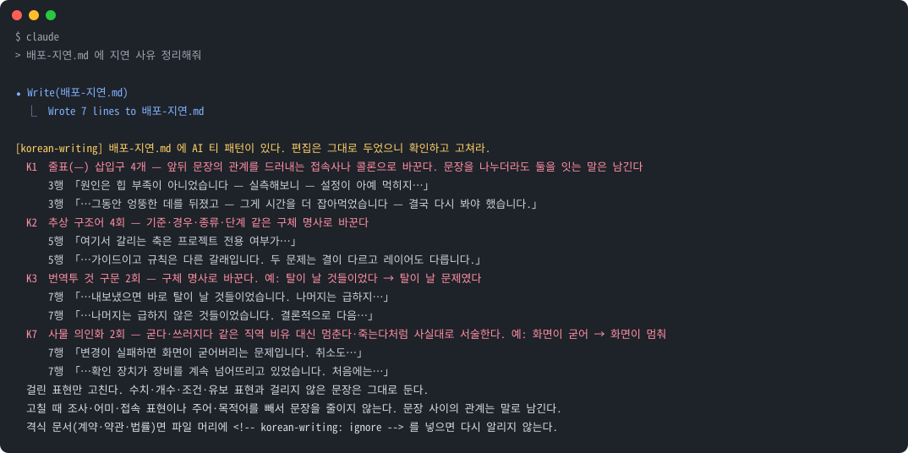

<picture>
  <source media="(prefers-color-scheme: dark)" srcset="docs/hero.svg">
  <source media="(prefers-color-scheme: light)" srcset="docs/hero-light.svg">
  
</picture>

<p align="center">
  <strong>한국어</strong> · <a href="README.en.md">English</a>
</p>

<p align="center">
  <strong>Claude Code가 번역투와 AI 티 없는 한국어를 쓰게 하는 플러그인입니다.</strong><br>
  <code>.md</code> 파일로 저장하면 그 턴 안에서 AI 티를 짚어 Claude에게 돌려줍니다.<br>
  이미 써 둔 글은 사실을 그대로 두고 문체만 다듬습니다.<br>
  설치 명령은 두 줄이고 따로 설정할 것은 없습니다. 작성한 내용은 에이전트 밖으로 나가지 않습니다.
</p>

<p align="center">
  <a href="https://github.com/IsthisLee/korean-writing/actions/workflows/validate.yml"></a>
  <a href="https://github.com/IsthisLee/korean-writing/actions/workflows/codeql.yml"></a>
  <a href="https://scorecard.dev/viewer/?uri=github.com/IsthisLee/korean-writing"></a>
  
  
  
  
  
  <a href="https://github.com/IsthisLee/korean-writing/commits/main"></a>
</p>

<p align="center">
  <a href="#개요">개요</a> ·
  <a href="#예시">예시</a> ·
  <a href="#3분-안에-해-보기">3분 시작</a> ·
  <a href="#설치">설치</a> ·
  <a href="#사용법">사용법</a> ·
  <a href="#무엇을-기반으로-하나">기반</a> ·
  <a href="#구성-요소">구성</a> ·
  <a href="#판정-규칙">판정 규칙</a> ·
  <a href="#검증">검증</a> ·
  <a href="#다른-도구와-무엇이-다른가">다른 도구와 비교</a> ·
  <a href="#자주-묻는-질문">FAQ</a>
</p>

> **v2.1.0**: 스킬을 적용할지 여부를 권한 창 대신 Claude가 한국어로 물으며, 「적용 안 함」을 선택하더라도 작업이 멈추지 않습니다. 자세한 변경 내용은 [CHANGELOG.md](CHANGELOG.md)에 정리되어 있습니다.

## 개요

Claude Code가 출력하는 한국어는 문법적으로 틀리지 않습니다. 그런데도 읽어 보면 어딘가 걸립니다. 영어의 어순을 그대로 옮긴 문장, 영어에서 건너온 비유, 그리고 어느 문서에서나 같은 자리에 놓이는 상투적인 표현이 그 원인입니다.

이런 어색함은 프롬프트로 그때그때 막기가 어렵습니다. 이미 완성된 글을 나중에 다듬더라도 「먼저·다음으로·마지막으로」처럼 늘어놓는 틀은 대개 그대로 남습니다. 그래서 이 플러그인은 Claude가 글을 파일로 저장하는 시점과 이미 쓴 글을 고치는 시점에 구성 요소를 하나씩 두었습니다. 처음 쓰는 글의 문체는 사용자가 고른 output style이 맡습니다. 설치하면 두 구성 요소가 함께 켜지므로 무엇을 언제 불러야 하는지 따로 외울 필요가 없습니다.

| 시점                                        | 무엇이 맡나                                                                                 | 언제 움직이나                   | 규칙이 적힌 곳                           |
| ------------------------------------------- | ------------------------------------------------------------------------------------------- | ------------------------------- | ---------------------------------------- |
| **저장할 때**<br>`.md`로 남는 것            | PostToolUse 훅이 방금 작성한 부분을 검사하고 걸린 자리를 같은 턴에 Claude에게 돌려줍니다     | `Edit`·`Write`·`MultiEdit` 직후 | `plugin/hooks-handlers/posttooluse.sh`   |
| **수정할 때**<br>남이 준 초안, 예전 문서 | 윤문 파이프라인이 사실은 그대로 두고 문체만 고칩니다                                        | 다듬어 달라는 요청이 오면       | `plugin/skills/humanize-korean/SKILL.md` |

여기에 글자 수 스킬이 하나 더 붙습니다. 글자 수는 모델이 어림잡는 대신 스크립트가 정확하게 계산합니다.

> 코드에 붙이는 린터를 한국어 산문에 붙인 것과 같습니다. 저장할 때의 검사는 걸린 자리를 그 턴 안에 Claude에게 돌려주므로 사람이 읽기 전에 고쳐집니다.

## 예시

### 문장, 전과 후

규칙이 어떤 문장을 잡는지는 정답 데이터를 전과 후로 비교하면 알 수 있습니다. 전은 모두 Claude Code가 실제로 작성했던 문장이며, 후는 이 저장소의 규칙대로 고친 문장입니다.

| 전 (Claude Code가 실제로 쓴 문장)                                                                               | 후 (규칙대로 고친 문장)                                                                                | 무엇이 문제였나                                                                |
| --------------------------------------------------------------------------------------------------------------- | ------------------------------------------------------------------------------------------------------ | ------------------------------------------------------------------------------ |
| 규칙이 충돌하면 상위 문서가 **이깁니다**. 둘 다 값이 있을 때는 텍스트가 **이기고** 강의실 참조는 무시됩니다.    | 규칙이 충돌하면 상위 문서를 따릅니다. 둘 다 값이 있을 때는 텍스트가 우선하고 강의실 참조는 무시됩니다. | 문서를 사람처럼 겨루게 하는 승패 의인화                                         |
| 원인은 힙 부족이 아니었습니다 **—** 실측해보니 **—** 설정이 아예 먹히지 않았습니다.                             | 원인은 힙 부족이 아니었습니다. 실측해 보니 설정이 아예 먹히지 않았습니다.                              | 영어 문장 부호를 옮긴 줄표 삽입구 |
| 여기서 갈리는 **축은** 프로젝트 전용 여부가 아니라 성격입니다. 두 문제는 **결이** 다르고 **레이어도** 다릅니다. | 여기서 갈리는 기준은 프로젝트 전용 여부가 아니라 성격입니다. 두 문제는 성격이 다른 별개의 문제입니다.  | 구조를 비유로 말하는 추상 구조어                                               |
| 시험용 장비가 몇 초 만에 **쓰러졌습니다**. **일으켜 세우면** 또 쓰러지기를 스무 분 넘게 반복했습니다.           | 시험용 장비가 몇 초 만에 멈췄습니다. 다시 켜면 또 멈추기를 스무 분 넘게 반복했습니다.                  | 영어 비유를 직역한 사물 의인화                                                 |

### 저장할 때 뜨는 화면

`.md` 파일을 고쳤을 때 Claude Code 화면에 나오는 모습입니다. 화면 틀은 그린 것이며 노란 줄부터는 훅이 실제로 출력한 내용 그대로입니다.

<p align="center"></p>

걸린 자리마다 줄 번호와 발췌가 붙으므로 Claude는 그 자리만 고칩니다. 이 출력은 Claude에게도 그대로 전달됩니다. Claude Code는 종료 코드 2로 끝난 PostToolUse 훅의 stderr를 같은 턴에 Claude에게 보여 주기 때문입니다([실험](./docs/experiments/hook-loop/)).

## 3분 안에 해 보기

1. 설치합니다. 명령은 두 줄이고 따로 설정할 것은 없습니다.
   ```bash
   claude plugin marketplace add IsthisLee/korean-writing
   claude plugin install korean-writing
   ```
2. 새 세션을 열고 글을 `.md` 파일로 써 달라고 요청합니다.
   ```
   이번 배포 QA 보고서를 배포-QA.md로 써줘.
   ```
3. 훅이 방금 작성한 부분을 검사하여 걸리는 것이 있으면 위와 같은 출력을 냅니다. Claude가 그 자리에서 고치며, 걸리는 것이 없으면 아무 말도 하지 않습니다.

## 설치

```bash
claude plugin marketplace add IsthisLee/korean-writing
claude plugin install korean-writing
```

`claude plugin list`에 `korean-writing`이 `enabled`로 보이면 설치가 끝난 것입니다. 새 버전은 `claude plugin update korean-writing`으로 받습니다. 받아 둔 저장소 경로를 마켓플레이스로 등록해도 됩니다. 사내 사본이나 포크를 쓸 때 그렇게 합니다.

```bash
claude plugin marketplace add /경로/korean-writing
claude plugin install korean-writing
```

| 필요한 것   | 어디에 쓰나                                                   | 없으면                                              |
| ----------- | ------------------------------------------------------------- | --------------------------------------------------- |
| Claude Code | 전부. 2.1.267에서 확인                                        |                                                     |
| `bash`      | 검사 훅과 스크립트                                           | 훅이 돌지 않습니다                                  |
| `python3`   | 검사 훅의 판정과 윤문 파이프라인의 스크립트. 윤문은 3.10 이상 | 검사 없이 통과합니다. 윤문 스크립트는 돌지 않습니다 |
| `node` 18+  | 글자 수 스크립트                                              | 그 스킬만 쓸 수 없습니다                            |

따로 받는 패키지는 없습니다. CI가 macOS와 Linux에서 같은 검사를 돌립니다. Windows는 Git Bash나 WSL이 필요한데 아직 돌려 보지 못했습니다.

### Claude Code 밖에서

글자 수 스킬은 [Agent Skills](https://agentskills.io/specification) 형식이므로 Codex·Cursor·Gemini CLI 같은 다른 에이전트에도 설치됩니다. [Skills CLI](https://skills.sh)가 저장소에서 스킬을 찾아 넣어 줍니다.

```bash
npx skills add IsthisLee/korean-writing -s korean-character-count -g
```

검사 훅과 윤문 파이프라인은 Claude Code에서만 동작합니다. 훅은 Claude Code의 훅 이벤트에 걸리고 윤문은 Claude Code 서브에이전트를 부르기 때문입니다. 다른 에이전트에서는 글자 수 계산만 남습니다.

## 사용법

평소처럼 말하면 됩니다. 윤문과 글자 수 스킬은 요청을 보고 스스로 뜨고 검사 훅은 `.md`를 저장할 때 돕니다. 아래 문장은 그대로 붙여 써도 됩니다.

```
아래 글 번역투만 고쳐줘. 사실과 숫자는 그대로 두고.
이 자기소개서 공백 포함 몇 자야? 1,000자 제한이야.
이 프로젝트 README 써줘. 오픈소스용으로.
이번 배포 QA 보고서를 배포-QA.md로 써줘.
```

언제 저절로 뜨는지와 이름으로 부를 때 무엇을 입력하는지를 한자리에 정리하면 다음과 같습니다.

| 무엇이                       | 저절로 도는 때                                            | 직접 부르는 명령                                               |
| ---------------------------- | --------------------------------------------------------- | -------------------------------------------------------------- |
| 윤문                         | "AI 티 없애줘", "번역투 고쳐줘" 같은 요청                 | `/korean-writing:humanize [글 또는 파일 경로]`                 |
| 2차 윤문                     | 뜨지 않습니다. 이름을 입력해야 돕니다                     | `/korean-writing:humanize-redo [지시]`                         |
| 검사 훅                      | `.md`를 `Edit`·`Write`·`MultiEdit`로 고친 직후          | `/korean-writing:check 파일...`                                |
| 글자 수                      | "500자 이내로", "글자 수 세줘" 같은 요청                  | `/korean-writing:korean-character-count`                       |

검사 훅은 부를 이름이 없습니다. 조건이 맞으면 저절로 돌고 아니면 돌지 않습니다. 윤문 진입 둘(`humanize`, `humanize-redo`)은 이름을 입력해야만 돌며, 그 대신 상시 컨텍스트를 한 토큰도 쓰지 않습니다.

평소 답변과 처음 쓰는 글의 문체는 사용자가 고른 output style이 맡습니다. 이 플러그인은 2026-09-14에 output style을 뺐고 2026-09-15에 작성 스킬(`/korean-writing`)을 뺐습니다. 그렇게 정한 이유는 [CHANGELOG.md](CHANGELOG.md)에 있습니다.

### 가장 좋은 글을 받는 순서

1. **`.md` 파일로 저장하게 합니다.** 검사 훅이 걸린 자리를 줄 번호와 함께 돌려주며 Claude가 같은 턴에 고칩니다.
2. **이미 있는 초안은 `/korean-writing:humanize`로 다듬습니다.** 윤문 파이프라인은 사실은 그대로 두고 문체만 고칩니다.

### 끄는 방법

끄는 범위는 여럿이고 규칙 몇 개만 골라 끌 수도 있습니다.

| 범위          | 방법                                                                                                     |
| ------------- | -------------------------------------------------------------------------------------------------------- |
| 파일 하나     | 파일 머리에 `<!-- korean-writing: ignore -->`. 계약서나 나쁜 예 모음처럼 매번 걸리는 게 맞지 않는 파일용 |
| 파일 하나의 규칙 몇 개 | 파일 머리에 `<!-- korean-writing: disable K1 K4 -->`. 줄표를 일부러 쓰는 문서처럼 한두 규칙만 맞지 않을 때 |
| 저장소        | 저장소에 `.korean-writing.json`을 커밋합니다. 팀이 같은 기준을 씁니다. 아래 예시                        |
| 규칙 몇 개를 계속 | 플러그인 설정의 `disabled_rules`나 환경변수 `KOREAN_WRITING_DISABLE_RULES=K1,K4`                     |
| 세션 전체     | `KOREAN_WRITING_HOOK_DISABLED=1`. 검사 훅을 끕니다                                 |
| 플러그인 전체 | `claude plugin disable korean-writing`                                                                   |

```json
{
  "disable": ["K1"],
  "ignore": ["legal/*", "CHANGELOG.md"]
}
```

훅은 편집한 파일에서 위로 올라가며 처음 만나는 `.korean-writing.json`을 씁니다. `.git`이 있는 폴더에서 멈추므로 저장소 밖의 설정이 섞이지 않습니다. 규칙을 끄는 방법은 훅의 알림에 적지 않았습니다. 알림에 그 방법이 있으면 Claude가 표현을 고치는 대신 규칙을 꺼 버릴 수 있기 때문입니다.

## 무엇을 기반으로 하나

이 플러그인의 한국어 판정은 임의로 정한 것이 아니라 세 층의 근거 위에 세워져 있습니다.

바탕은 번역학입니다. 한국 번역학계가 오래 다뤄 온 여덟 가지 번역투(무생물 주어, 피동 과다, 대명사 직역, `-들` 기계적 부착, 관계절 직역, 명사화, 조사 결합, 종결어미)와 국제 번역학 이론(Baker 1993 번역 보편소, Toury 1995, Toral 2019 post-editese)에서 패턴을 가져왔습니다. 여기에 AI 한글 티 분류 체계가 더해집니다. im-not-ai의 10분류 84항목으로 번역투부터 리듬 균일성과 과도한 수식, 완곡까지 심각도를 매겨 나눈 체계입니다.

규칙은 실측으로 걸러집니다. im-not-ai는 대조 코퍼스로 패턴마다 판별력을 재어 사람 글에도 흔한 패턴을 기각했으며 모델 의존성을 점검하여 한 모델에서만 두드러진 항목을 따로 갈라냈습니다. 부정 대구와 연결어미 뒤 쉼표 같은 항목은 사람이 쓴 글 532편으로 다시 재어 기준을 조정했습니다. 이 저장소도 검사 훅의 규칙을 실제 문서 뭉치에 돌려 같은 방식으로 걸렀습니다. 「서버가 죽었다」는 개발자의 일상어이므로 K7에서 「죽다」를 뺐습니다. 사람이 쓴 글만 잡던 `~에 대해`·`~를 통해` 횟수 판정은 K8에서 뺐습니다. 판별력이 큰 규칙이라도 고치는 법이 문장 성분을 빼게 하면 뺐습니다. 2026-09-14에 부정 대구와 연결어미 뒤 쉼표, 첫째·둘째 병렬을 뺀 것이 그 경우입니다.

근거가 되는 문서는 [docs/foundations.md](docs/foundations.md)에 한자리에 모여 있습니다. 연구 문헌, 분류 체계, 이 저장소가 직접 만든 판정, 재현 장비가 어디에 있는지 그 문서가 가리킵니다.

## 구성 요소

플러그인에 든 것은 다음과 같습니다.

| 구성        | 수     | 무엇                                                                                                                                                    |
| ----------- | ------ | ------------------------------------------------------------------------------------------------------------------------------------------------------- |
| 스킬        | 4      | 이 저장소 하나 `korean-character-count`. im-not-ai 내장 셋 `humanize-korean`, `humanize`, `humanize-redo` |
| 훅          | 1      | `.md` 편집 직후 검사 |
| 검사 패턴   | 7      | `K1`~`K4`, `K6`~`K8`. 줄표, 추상 구조어, 것 구문, AI 관용구, 승패 의인화, 사물 의인화, 번역투                                                          |
| 에이전트    | 3      | im-not-ai 내장. 윤문 파이프라인의 진단·윤문·마무리 검토                                                                                                 |
| 규칙집      | 84항목 | im-not-ai의 분류 체계. 10분류, 항목마다 심각도와 처방                                                                                                   |
| 정답 데이터 | 15문장 | Claude Code가 실제로 생성한 위반 10건, 같은 맥락의 정상 5건                                                                                             |
| 스크립트    | 5 + 9  | 이 저장소 다섯은 글자 수·통째 검사·오탐 측정·릴리스·그림. im-not-ai 내장 아홉은 윤문 파이프라인용 |
| 네트워크    | 없음   | 훅은 bash와 python3 정규식, 글자 수는 `node:fs`                                                                                                         |

- **윤문(im-not-ai 내장).** 써 둔 글을 다듬는 파이프라인은 이 저장소가 만들지 않았습니다. [im-not-ai](https://github.com/epoko77-ai/im-not-ai)의 런타임 부분집합을 커밋 `9747f03`에서 그대로 가져와 실었습니다. 글의 상태에 따라 한 콜에서 세 콜까지 경로를 고르며 변경률이 50%를 넘으면 결과를 버립니다. 가져온 파일에서 고친 것은 스킬 설명의 트리거 문구 한 줄뿐입니다.
- **`korean-character-count` 스킬.** 길이 제한이 걸린 글에 뜹니다. `각`은 눈에 한 글자여도 UTF-8로는 3바이트이며 자모를 조합한 글자는 코드포인트로 셋입니다. 그래서 모델이 어림잡는 대신 스크립트가 계산합니다. 세는 규칙의 계약은 `plugin/skills/korean-character-count/instruction.md`에 있습니다.
- **검사 훅.** `Edit`·`Write`·`MultiEdit`가 `.md`를 고친 직후에 이번에 작성한 부분만 봅니다. 전체를 보면 예전 표현이 편집마다 다시 걸려 소음이 되기 때문입니다. 써 둔 문서를 점검하거나 CI·pre-commit에서 쓰려면 `plugin/scripts/check.sh 파일...`을 실행하며, 걸린 파일이 있으면 종료 코드 1을 냅니다.

## 판정 규칙

훅은 다음 순서로 판정합니다.

1. `Edit`·`Write`·`MultiEdit` 가운데 하나가 끝나면 Claude Code가 그 도구 입력을 JSON으로 만들어 `plugin/hooks-handlers/posttooluse.sh`의 stdin에 넣습니다.
2. `KOREAN_WRITING_HOOK_DISABLED`가 1이거나 `python3`를 찾지 못하면 아무것도 보지 않고 통과합니다.
3. 경로가 `.md`가 아니면 통과합니다.
4. 도구 입력에서 이번에 작성한 부분만 모읍니다. 그 부분이나 파일 앞 열 줄에 `<!-- korean-writing: ignore -->`가 줄 하나로 서 있으면 통과합니다.
5. 코드블록, 인라인 코드, URL, 표 행, HTML 주석을 걷어냅니다. 표를 통째로 빼는 이유는 나쁜 예를 인용하는 문서가 그 예 때문에 걸리면 안 되기 때문입니다.
6. 남은 본문에서 한글이 30%를 넘으면 그대로 검사하고, 못 미치면 한글이 30% 이상인 줄만 골라서 봅니다. 골라낸 뒤 한글이 20자에 못 미치면 통과합니다.
7. `K1`~`K4`와 `K6`~`K8` 정규식을 돌립니다.
8. 하나도 걸리지 않으면 종료 코드 0으로 조용히 끝납니다. 걸리면 항목마다 무엇이 몇 번 나왔고 어떻게 고치는지를 stderr에 쓰고 종료 코드 2를 냅니다. 어느 쪽이든 파일에는 손대지 않습니다.

| 코드  | 무엇을           | 정규식이 보는 것                                                                    | 걸리는 시점                                     |
| ----- | ---------------- | ----------------------------------------------------------------------------------- | ----------------------------------------------- |
| `K1`  | 줄표 삽입구      | 양쪽에 공백과 글자가 있는 `—`·`–`                                                   | 4개. 이번 편집에 하나라도 있으면 파일 전체로 셈 |
| `K2`  | 추상 구조어      | `축이·축은·축을·축으로`, `갈래`, `결이 다르`, `레이어`                              | 3회                                             |
| `K3`  | 번역투 `것` 구문 | `것들이었`·`것들이다`, `것들을`, `하는 것이 가능`                                   | 1회                                             |
| `K4`  | AI 관용구        | `시사하는 바가 크`, `주목할 만하`, `혁신적`·`획기적`·`압도적`                       | 1회                                             |
| `K6`  | 승패 의인화      | `~가 이긴다·이깁니다·이겼다·이기고`                                                 | 2회                                             |
| `K7`  | 사물 의인화      | 화면·서버·장비 등이 `굳·쓰러지·넘어지·일어서·잠들`, `넘어뜨리·일으켜 세우·쓰러뜨리` | 1회                                             |
| `K8`  | 번역투           | `가지고 있`, 이중 피동 `되어지`, `에 의해`                                          | 항목별로 1회, `에 의해`는 2회                   |

`K5` 기계적 병렬, `K9` 부정 대구, `K10` 연결어미 뒤 쉼표는 2026-09-14에 뺐습니다. fluent-korean 문체 지침을 켜고 받은 답변 12개 가운데 4개가 `K5`·`K9`에 걸렸고 그 지침 원문은 `K10`에 걸렸습니다. `K9` 처방대로 문장을 둘로 나누다가 인과를 잇는 말이 끊긴 표본도 있었습니다. 같은 날 `K4`에서는 `결론적으로`·`종합하면` 같은 접속 표현과 `라고 할 수 있다`를, `K8`에서는 보조 용언 `지게 된다`를 뺐습니다. 뺀 번호는 다시 쓰지 않으므로 설정에 적어 둔 `K9`는 어떤 규칙도 끄지 않습니다([EVALUATION.md](EVALUATION.md) O절).

줄표는 파일 전체를 셉니다. 문단을 하나씩 고쳐 나가면 편집마다 한두 개씩 들어가 파일에는 수십 개가 쌓이는데, 편집분만 세면 어느 편집도 임계에 닿지 않기 때문입니다. 이번 편집에 없으면 파일에 몇 개가 있든 잡지 않으므로 예전 문서를 고칠 때 소음이 늘지는 않습니다.

임계는 규칙집보다 하나씩 높습니다. 이 훅은 막지 않고 알리기만 합니다. 멀쩡한 문장을 잡아 작업을 끊는 쪽이 하나를 놓치는 쪽보다 해롭기 때문입니다.

## 설계 원칙

**막지 않습니다.** 검사 훅은 알릴 뿐 편집을 되돌리지 않습니다. `python3`가 없는 컴퓨터에서는 검사를 건너뜁니다. 검사기가 작업을 막기 시작하면 사람은 검사기를 꺼 버립니다.

**숫자 없이는 규칙을 바꾸지 않습니다.** 패턴 하나를 넣거나 빼거나 임계를 옮길 때마다 실제 문서에 돌린 결과가 있어야 합니다. 그렇게 바꾼 기록이 [EVALUATION.md](./EVALUATION.md)에 있습니다.

**멀쩡한 문장을 잡는 것이 놓치는 것보다 나쁩니다.** 합격 기준의 순서가 그렇습니다. 정상 문장 오탐 0건이 먼저이고 위반 검출은 그다음입니다.

**바깥과 통신하지 않습니다.** 훅이 무엇을 읽고 무엇을 하지 않는지는 [SECURITY.md](./SECURITY.md)에 있으며 그것을 직접 확인하는 `grep` 명령도 거기 있습니다.

**늘 읽히는 것은 작게 둡니다.** 평소 컨텍스트에 들어가는 것은 스킬 설명 넷과 에이전트 설명 셋뿐이며 큰 파일은 그 일이 생겼을 때만 열립니다.

**가져온 파일은 가져온 대로 둡니다.** 윤문 파이프라인과 글자 수 스크립트는 다른 MIT 프로젝트의 것입니다. 어디서 어느 커밋을 가져왔고 어느 줄을 고쳤는지는 [plugin/NOTICE.md](./plugin/NOTICE.md)에 파일 단위로 적어 두었습니다.

## 검증

무엇을 근거로 판정하는지는 [docs/foundations.md](./docs/foundations.md)가 한자리에서 가리키며 합격 기준과 측정 결과는 [EVALUATION.md](./EVALUATION.md)에 있습니다. 핵심 숫자만 옮기면 다음과 같습니다.

| 측정                    | 결과                          |
| ----------------------- | ----------------------------- |
| 실제 문서 오탐          | 1 / 205 (0.5%)                |
| 정상 문장 오탐          | 0 / 5                         |
| 훅 알림 뒤 같은 턴 교정 | 3 / 3 (플러그인 없이는 0 / 3) |
| 외부 네트워크 호출      | 0                             |
| 회귀 테스트             | 84 / 84                       |

실제 문서 오탐은 한 컴퓨터에 쌓여 있던 한국어 `.md` 205개로 쟀습니다. 통째로 훅에 넣으니 85개가 걸렸으며 파일 수정 연도로 갈랐을 때 2023년 이전에 쓰인 32개 중 걸린 것은 하나입니다.

## 하지 않는 것

- **평소 답변에는 규칙을 넣지 않습니다.** v1.1.0까지는 세션을 열 때와 서브에이전트가 뜰 때 답변 규칙을 넣었습니다. 문체는 나아졌지만 답에서 기본값 같은 세부가 빠지는 것을 재서 확인하고 뺐습니다([EVALUATION.md](./EVALUATION.md) H13). 평소 대화의 문체는 이 플러그인이 맡지 않습니다.
- **처음 쓰는 글에도 규칙을 넣지 않습니다.** 2026-09-15까지는 `/korean-writing`으로 부르는 작성 스킬이 있었습니다. 지금은 사용자가 고른 output style이 문체를 맡고 이 플러그인은 저장한 뒤의 검사와 윤문을 맡습니다.
- 검사 훅은 `.md` 파일만 봅니다. 코드 안의 한국어 주석과 문자열, 슬랙으로 바로 나가는 답변은 사후 검사가 없습니다.
- 정규식은 알려진 패턴 일곱 종만 잡습니다. 새로운 어색함은 사람이 찾아 넣어야 합니다.
- 훅이 짚은 것만 고칩니다. 짚지 못한 표현은 남습니다.
- 계약서·약관·법률 문서·공문처럼 격식이 요건인 글은 대상이 아닙니다. 코드·로그·명령어·직접 인용·고유명사·영어 원문도 손대지 않습니다.
- 맞춤법과 띄어쓰기는 보지 않습니다. 문체만 봅니다.

## 저장소 구성

저장소는 두 층입니다. **`plugin/`만 설치한 사람의 기계로 복사됩니다.** 플러그인 설치는 폴더를 통째로 가져가며 무엇을 뺄 수단이 없으므로 테스트와 실험과 CI는 그 밖에 둡니다. CI의 `설치본 경계` 작업이 이 선을 지킵니다.

```
korean-writing/
├── plugin/                ── 설치본. 이 폴더만 남의 기계로 갑니다 ──
│   ├── .claude-plugin/    매니페스트(이름·버전 정본·스킬 경로)
│   ├── hooks/             PostToolUse 등록
│   ├── hooks-handlers/    .md 편집 후 검사(K1~K4, K6~K8)
│   ├── commands/          /korean-writing:check
│   ├── agents/·skills/    im-not-ai 내장 윤문 + 글자 수 스킬
│   ├── scripts/           통째 검사 + im-not-ai 윤문 스크립트
│   └── NOTICE.md·LICENSE  가져온 파일의 출처와 MIT
│
├── tests/                 ── 아래는 저장소에만 있습니다 ──
│                          회귀 테스트와 정답 데이터
├── tools/                 관리자 스크립트(가드·릴리스·측정·그림)
├── docs/                  배너, 윤문 실행 기록, 실험, foundations.md
├── EVALUATION.md          합격 기준과 측정 결과
├── CLAUDE.md              이 저장소에서 작업하는 Claude의 규칙
└── README.md·README.en.md
```

## 다른 도구와 무엇이 다른가

한국어를 자연스럽게 만드는 도구는 이미 여럿 있습니다. 가장 널리 쓰이는 것은 다 쓴 글을 고치는 윤문 도구이며 이 플러그인의 윤문도 그중 하나인 im-not-ai를 커밋째 고정해 내장한 것입니다. 이 플러그인이 더하는 것은 그 앞의 한 시점, Claude가 파일을 저장한 바로 그 턴입니다.

| 도구                                                                  | 처음 작성할 때                                            | 저장할 때                                           | 수정할 때                            | 네트워크                                          |
| --------------------------------------------------------------------- | --------------------------------------------------------- | --------------------------------------------------- | ------------------------------------ | ------------------------------------------------- |
| **korean-writing**                                                    |                                                           | 편집 직후 훅이 검사해 같은 턴에 Claude에게 돌려줌   | im-not-ai 내장                       | 쓰지 않음. CI가 막음                              |
| [im-not-ai](https://github.com/epoko77-ai/im-not-ai)                  |                                                           |                                                     | 윤문 파이프라인(1~3콜)               | 쓰지 않음                                         |
| [fluent-korean](https://github.com/snflkd/fluent-korean)              | output-style로 모든 답변에 적용. 목표는 뜻이 분명한 문장  |                                                     |                                      | 쓰지 않음                                         |
| [patina](https://github.com/devswha/patina)                           |                                                           | 커밋할 때 pre-commit 훅이 Markdown에 점수를 매김    | 윤문(스킬·CLI·웹), 한·영·중·일       | 웹판은 서버에서 처리                              |
| [k-skill](https://github.com/NomaDamas/k-skill) `korean-humanizer`    |                                                           |                                                     | 윤문                                 | 지침을 `npx`로 받음. 맞춤법 검사는 외부 검사기    |

2026-09-11에 각 저장소를 열어 확인한 내용입니다. 빈칸은 그 시점을 맡는 기능을 찾지 못했다는 뜻입니다. 저장할 때의 검사는 patina에도 있지만 patina는 사람이 커밋할 때 걸리고 이 플러그인은 Claude가 파일을 고친 그 턴에 걸립니다.

평소 답변을 맡는 output style은 이 플러그인이 싣지 않습니다. fluent-korean 같은 스타일을 켜 두어도 검사 훅과 윤문은 그대로 동작합니다.

## 자주 묻는 질문

<details>
<summary><b>왜 검사 훅은 .md 파일만 보나요?</b></summary>

훅은 파일 편집 도구가 끝난 뒤에 도구 입력을 받는 구조라 파일이 아닌 답변은 볼 수 없습니다. 답변을 정규식으로 사후 검사하는 것도 재 봤는데 평소 답변에서는 표본당 0.21건밖에 잡지 못해 감시 수단으로 쓰지 않습니다.

근거: [EVALUATION.md](./EVALUATION.md)의 N3.

</details>

<details>
<summary><b>훅이 내 편집을 되돌리나요?</b></summary>

되돌리지 않습니다. 훅이 하는 일은 걸린 항목을 stderr에 쓰고 종료 코드 2를 내는 것까지입니다. 파일은 편집된 그대로 남으며 고칠지 말지는 Claude Code와 사람이 정합니다.

근거: [SECURITY.md](./SECURITY.md)의 「이 플러그인이 하는 일」 표.

</details>

<details>
<summary><b>내 글이 외부로 나가나요?</b></summary>

나가지 않습니다. 훅은 bash 안에서 python3 정규식을 돌릴 뿐이며 글자 수 스크립트는 `node:fs` 말고는 아무것도 불러오지 않습니다. 네트워크 호출과 외부 프로그램 실행이 없다는 것은 [SECURITY.md](./SECURITY.md)의 `grep` 명령 세 개로 누구나 확인할 수 있습니다.

</details>

<details>
<summary><b>계약서나 약관을 고칠 때도 걸리나요?</b></summary>

걸립니다. 그래서 파일 머리에 `<!-- korean-writing: ignore -->` 한 줄을 넣어 그 파일만 검사에서 빼는 방법을 두었습니다.

</details>

<details>
<summary><b>토큰을 얼마나 쓰나요?</b></summary>

상시로 드는 것은 스킬 설명 넷 약 430토큰(내장한 윤문 스킬 230 포함)과 에이전트 셋 약 300토큰입니다. 스킬 본문은 그 스킬을 쓸 때만 로드되며 훅은 LLM을 부르지 않습니다.

근거: [EVALUATION.md](./EVALUATION.md)의 D2와 F7.

</details>

<details>
<summary><b>설치했는데 스킬이 안 보여요.</b></summary>

먼저 `claude plugin list`에서 `korean-writing`이 `enabled`로 나오는지 봅니다. 저장소를 `~/.claude/skills/`에 링크해 둔 채로 마켓플레이스 설치까지 했다면 둘 중 하나를 지웁니다. 스킬 목록은 세션을 새로 열어야 바뀝니다.

</details>

<details>
<summary><b>Windows에서 되나요?</b></summary>

돌려 보지 않았습니다. 훅이 bash 스크립트여서 Git Bash나 WSL이 있어야 합니다. `.gitattributes`가 스크립트를 LF로 고정하므로 CRLF로 체크아웃되어 훅이 깨지는 일은 없습니다. 써 본 결과를 이슈로 남겨 주시면 여기에 적겠습니다.

</details>

## 기여

절차는 [CONTRIBUTING.md](./CONTRIBUTING.md)에 있습니다. 가장 값진 기여는 코드가 아니라 문장입니다. Claude Code가 쓴 어색한 한국어를 봤거나 훅이 멀쩡한 문장을 잡았다면 [어색한 문장 제보](https://github.com/IsthisLee/korean-writing/issues/new?template=awkward-sentence.yml) 양식으로 고치지 않은 원문 그대로 보내 주세요. 제보한 문장은 정답 데이터나 정상 문장에 들어가 회귀 테스트가 됩니다.

작업을 시작하면 기준선부터 잡습니다.

```bash
git clone https://github.com/IsthisLee/korean-writing.git
cd korean-writing
python3 tests/test_posttooluse.py
plugin/scripts/check.sh --all
```

판정 규칙을 바꾸는 변경에는 `tools/measure.sh`로 실제 문서에 돌린 숫자와 회귀 테스트가 같이 옵니다. 한국어 문서를 고쳤으면 `plugin/scripts/check.sh`를 통과시키고 README는 한국어판과 영어판을 함께 고칩니다. 커밋 제목은 Conventional Commits 형식의 한국어이며 버전 번호는 손대지 않습니다.

## 출처와 라이선스

| 파일                                                                                              | 어디서                                                                                                                         | 고친 것                                                     |
| ------------------------------------------------------------------------------------------------- | ------------------------------------------------------------------------------------------------------------------------------ | ----------------------------------------------------------- |
| `plugin/skills/humanize-korean/`, `plugin/skills/humanize/`, `plugin/skills/humanize-redo/`, `plugin/agents/`, `plugin/scripts/*.py` | [im-not-ai](https://github.com/epoko77-ai/im-not-ai) 커밋 `9747f03` (2026-09-06)의 런타임 부분집합                             | 스킬 설명의 트리거 문구 하나                                |
| `plugin/skills/korean-character-count/`                                                                  | [k-skill](https://github.com/NomaDamas/k-skill)                                                                                | 스크립트는 그대로, 설명서는 실행 경로만, SKILL.md는 다시 씀 |

나머지는 이 저장소에서 만들었습니다. 검사 훅 전체, 정답 데이터, 검증 기준이 그것입니다. 가져온 파일의 라이선스는 전부 MIT이며 원 저작권 표시는 [plugin/NOTICE.md](./plugin/NOTICE.md)에 모아 두었습니다. 이 저장소의 라이선스도 [MIT](./LICENSE)입니다.

---

<p align="center"><sub>Built with <a href="https://claude.com/claude-code">Claude Code</a> · <a href="./LICENSE">MIT</a></sub></p>
