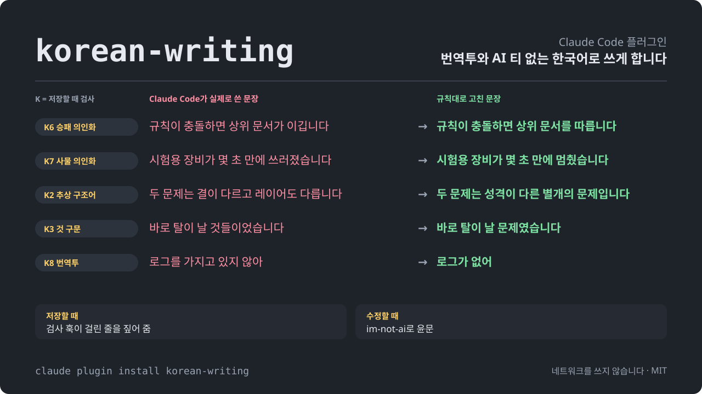

<picture>

  <source media="(prefers-color-scheme: dark)" srcset="docs/assets/hero.svg">

  <source media="(prefers-color-scheme: light)" srcset="docs/assets/hero-light.svg">

  

</picture>

<p align="center">

<strong>내가 쓰려고 다양한 한국어 도구들 분석하고, 원하는 것만 묶고 맘대로 커스텀한 Claude Code 플러그인</strong><br>  
무엇을 묶을지는 사람이 쓴 글과 Claude가 쓴 글을 직접 비교한 결과로 정했습니다.

</p>

<p align="center">

<a href="https://github.com/IsthisLee/korean-writing/actions/workflows/validate.yml"></a>
<a href="https://github.com/IsthisLee/korean-writing/actions/workflows/codeql.yml"></a>

  

  

  

  

</p>

> [!NOTE]
> 표본은 학습에 사용하지 않습니다.
>
> 한국어 검사 도구를 검증하는 용도로만 사용합니다.

> [!IMPORTANT]
> 이 README는 [분석 계획](docs/analysis/korean-ai-writing-signals.md)을 모두 마친 상태를 기준으로 썼습니다. 지금은 본 측정에 쓸 사람 글을 모으는 중이라서, 「측정 전」이라고 적힌 칸에는 아직 결과가 없습니다.

## 이 플러그인은

Claude Code로 한국어 문서를 쓰면서 번역투와 AI 티를 줄여 준다는 도구를 여럿 써 봤습니다. 써 보니 두 가지가 걸렸습니다. 도구마다 AI 티라고 부르는 목록의 근거가 약했고, 도구가 알려 준 대로 고치다가 원래 있던 내용이 사라진 적도 있었습니다.

그래서 도구를 고르기 전에 사람이 쓴 글과 Claude가 쓴 글을 직접 비교했습니다. 두 글을 실제로 가르는 신호로 검사기를 만들고, 그 검사기로 문체 도구와 윤문 도구를 같은 조건에서 견줬습니다. 비교로 고를 수 있는 도구는 기준을 통과한 것만 묶었고, 묶은 도구도 제 작업 방식에 맞게 고쳤습니다. 모두에게 맞추려는 범용 도구가 아니라 제가 쓰려고 만든 묶음입니다.

도구를 고르는 기준은 두 가지이고, 첫째가 둘째보다 앞섭니다.

1. **의미가 절대 손실되지 않는 명확한 한국어**
2. **번역체 교정과 AI 표현 최소화**

뜻을 하나라도 잃은 도구는 AI 티가 아무리 적어도 묶지 않습니다.

## 묶은 것

| 기능        | 하는 일                                                                                           | 어떻게 골랐나                                                                                                                                                                                                | 가져온 곳                                                                           |
| ----------- | ------------------------------------------------------------------------------------------------- | ------------------------------------------------------------------------------------------------------------------------------------------------------------------------------------------------------------ | ----------------------------------------------------------------------------------- |
| **윤문**    | 이미 쓴 글을 사실과 숫자는 그대로 두고 문체만 다듬습니다                                          | 후보 9개를 같은 원문에 돌려, 뜻 손실이 0건인 도구 가운데 AI 신호가 가장 적은 것을 묶습니다                                                                                                                   | 측정 전. 지금은 [im-not-ai](https://github.com/epoko77-ai/im-not-ai) 커밋 `9747f03` |
| **검사 훅** | `.md` 를 고친 직후 AI 티 표현을 찾아 같은 턴에 Claude에게 알립니다. Claude는 걸린 자리만 고칩니다 | 지금 규칙과 표본에서 뽑은 표현을 같은 기준으로 판정해, 사람 글 600편을 한 편도 잡지 않고 Claude 글을 잡은 규칙만 남깁니다. 알림 문구는 고쳤을 때 뜻이 사라지지 않는지 잽니다([EVALUATION.md](EVALUATION.md)) | 직접 만듦                                                                           |
| **글자 수** | 한국어 글자 수를 모델이 어림잡지 않고 스크립트로 셉니다                                           | 세기만 하는 도구라서 비교하지 않았습니다                                                                                                                                                                     | [k-skill](https://github.com/NomaDamas/k-skill)                                     |

플러그인에 넣지 않고 따로 쓰는 것이 둘 있습니다.

| 무엇                    | 하는 일                                                                       | 어떻게 골랐나                                                                                               | 어디에                                                                                                            |
| ----------------------- | ----------------------------------------------------------------------------- | ----------------------------------------------------------------------------------------------------------- | ----------------------------------------------------------------------------------------------------------------- |
| **권하는 output style** | 평소 답변과 처음 쓰는 글의 문체를 정합니다                                    | 한국어 output style 을 같은 요청에 켜고 비교해, 뜻 손실이 0건인 것 가운데 AI 신호가 가장 적은 것을 권합니다 | 측정 전                                                                                                           |
| **AI 신호 검사기**      | 글 한 편의 AI 신호 점수를 내고 문턱을 넘으면 알립니다. 고치게 하지는 않습니다 | 사람 글 600편과 Claude 글 1,200편으로 만들고, 검증용 사람 글 300편에서 한 편도 잡지 않는지 확인합니다       | 저장소의 [`docs/experiments/ai-writing-signals/`](docs/experiments/ai-writing-signals/). 설치본에는 넣지 않습니다 |

<p align="center">

</p>

### 묶으며 고친 것

| 도구            | 고친 것                                                                                                                                          |
| --------------- | ------------------------------------------------------------------------------------------------------------------------------------------------ |
| 검사 훅         | 안내대로 고치면 문장 성분이 빠지던 규칙 셋(`K5`, `K9`, `K10`)을 뺐고, 안내 문구에 조사·접속 표현이나 주어·목적어를 빼지 말라는 조건을 넣었습니다 |
| im-not-ai 윤문  | 런타임에 쓰는 스킬 셋, 에이전트 셋, 스크립트 아홉만 가져왔고, `humanize-korean` 설명의 트리거 문구 "AI detector bypass 한글" 하나만 뺐습니다     |
| k-skill 글자 수 | 스크립트는 그대로 두고 실행 경로를 고쳤으며, 스킬 설명은 원본을 바탕으로 다시 썼습니다                                                           |

비교 결과로 윤문 도구를 바꾸면 이 표와 [plugin/NOTICE.md](plugin/NOTICE.md)를 함께 고칩니다.

### 뺀 것

써 보고 뺀 기능입니다. 경위는 [CHANGELOG.md](CHANGELOG.md)에 있고, 측정 기록은 문서를 정리하며 지워 커밋 `92b1e47` 의 EVALUATION.md 에 남아 있습니다.

| 뺀 것                                       | 이유                                                                                                                      |
| ------------------------------------------- | ------------------------------------------------------------------------------------------------------------------------- |
| 평소 답변과 서브에이전트에 문체 규칙 주입   | 규칙을 넣으면 답에서 기본값 같은 세부가 빠졌습니다. 같은 길이의 중립 문장을 넣었을 때는 빠지지 않았습니다(H13절)          |
| 이 플러그인이 쓰던 작성 스킬과 output style | 평소 답변과 처음 쓰는 글의 문체는 사용자가 고른 output style 에 맡겼습니다. 어떤 것을 권할지는 비교 결과로 정합니다(J3절) |

## 어떻게 골랐나

### 왜 직접 비교했나

1. **널리 퍼진 AI 티 목록은 근거가 약합니다.** 동료 심사를 거친 논문과 국립국어원 간행물에서 사람 글과 비교해 차이가 보고된 특징만 모으니 43가지였습니다. 그중 한국어 AI 글을 직접 다룬 연구는 두 편뿐이었고, 흔히 말하는 줄표·복수형 `-들`·「A가 아니라 B」 대구는 그런 연구를 찾지 못했습니다.
2. **사람 글을 AI 글로 잘못 잡으면 해롭습니다.** 영어 AI 탐지기가 비원어민이 쓴 글을 AI 글로 잘못 분류했다는 연구가 있습니다([Liang 외 2023](https://arxiv.org/abs/2304.02819)).
3. **규칙대로 고치다가 뜻을 잃은 적이 있습니다.** 옛 검사 훅의 안내대로 고친 대조 글에서 정보가 사라지거나 문장을 잇는 말이 빠졌습니다([EVALUATION.md](EVALUATION.md) I·O절).
4. **예전 측정은 근거가 되지 못했습니다.** 사람 글을 파일 수정 연도로 짐작했고, 합격선을 결과를 본 뒤에 적었습니다.

### 비교 순서

| 단계                   | 하는 일                                                                                                                                                                                                                                               |
| ---------------------- | ----------------------------------------------------------------------------------------------------------------------------------------------------------------------------------------------------------------------------------------------------- |
| 1. 기준 공개           | 표본, 판정 기준, 비교 순서를 결과보다 먼저 [분석 계획](docs/analysis/korean-ai-writing-signals.md)에 적고 커밋합니다                                                                                                                                  |
| 2. 파일럿              | 사람 글 30편과 Claude 글 30편으로 수집부터 판정까지 두 번 돌려 방법을 고칩니다                                                                                                                                                                        |
| 3. 사람 글 수집        | ChatGPT가 공개된 2022-11-30 이전의 글 600편을 모읍니다. 위키백과 옛 판 300편, 기업 기술 블로그 150편(회사마다 15편까지), 개인 블로그 150편입니다. 블로그 글은 Common Crawl이 그날 전에 수집한 본문만 쓰고, 번역 위주 블로그는 뺍니다                  |
| 4. Claude 글 생성      | 사람 글마다 같은 제목과 장르로 claude-opus-5 와 claude-sonnet-5 가 한 편씩, 모두 1,200편을 씁니다. output style, 사용자 설정, 도구 없이 씁니다                                                                                                        |
| 5. 신호 계산           | 짝마다 긴 쪽 글을 짧은 쪽 길이에 맞춰 문장 경계에서 자른 뒤, 형태소 분석기 Kiwi로 연구 근거가 있는 지표 40개를 잽니다                                                                                                                                 |
| 6. 검사기 만들기       | 선별용 표본(사람 글 300편과 짝이 되는 Claude 글)에서 성격이 같은 지표 20묶음마다 가장 잘 가르는 지표를 고르고, 그 로그 우도비를 더해 문서 점수를 만듭니다                                                                                             |
| 7. 문턱 확인           | 검증용 사람 글 300편이 한 편도 넘지 않도록 문턱을 정합니다. 300편에서 0건이면 사람 글을 잘못 잡는 비율이 1%를 넘지 않는다고 95% 확신할 수 있습니다. 개인 블로그에만 오판이 몰리지 않는지 장르별로도 봅니다                                            |
| 8. 검사 훅 규칙 정하기 | 지금 K 규칙과 선별용 표본에서 뽑은 표현마다, 선별용 사람 글에 가장 많이 나온 횟수보다 1 많은 횟수를 문턱으로 삼습니다. 사람 글 600편이 한 편도 문턱을 넘지 않고 검증용 Claude 글이 한 편 이상 넘은 규칙만 남기며, 지금 규칙도 사람 글을 잡으면 뺍니다 |
| 9. 도구 비교           | output style 후보와 윤문 도구 후보에 같은 요청과 같은 원문을 넣고 아래 기준으로 잽니다                                                                                                                                                                |
| 10. 결정과 기록        | 무엇을 묶고 권했는지와 그 이유를 분석 계획에 적고 이 README에 반영합니다                                                                                                                                                                              |

### 도구 비교 기준

1. **뜻 손실이 0건인 도구만 남깁니다.** 원문이나 요청에 담긴 사실을 목록으로 미리 만들고, 결과 글에서 사라지거나 바뀌거나 새로 생긴 사실과 빠진 문장 성분을 셉니다. 1건이라도 있으면 탈락입니다.
2. **AI 신호 밀도가 낮은 순으로 세웁니다.** 검사기 점수를 1,000자당으로 세고, 사람 글의 값을 기준선으로 함께 적습니다.
3. **밀도가 같으면 명확성으로 가립니다.** 주어나 지시 대상이 모호한 곳을 셉니다.

뜻 손실은 claude-opus-5 가 순서를 바꿔 두 번 판정하고, 판정의 일부는 사람이 원문과 대조합니다. 원문을 얼마나 바꿨는지(변경률)도 기록해서 과하게 고친 경우를 가려냅니다.

## 분석 결과

본 측정을 마치면 채웁니다. 파일럿 두 번의 결과는 [비교 분석 안내](docs/analysis/README.md#7-결과는-언제-어디서-보나)에 있습니다. 요약하면 신호 하나로는 두 글을 가르지 못했고, 여러 신호를 합친 점수는 새 표본에서도 사람 글과 Claude 글을 갈랐습니다(AUROC 0.83). 다만 파일럿 30편으로 정한 문턱은 새 사람 글 30편 가운데 6편이 넘어서, 문턱은 본 측정에서 정합니다.

### AI 신호 검사기

| 항목                                       | 결과              |
| ------------------------------------------ | ----------------- |
| 검증용 사람 글 300편 가운데 문턱을 넘은 글 | 측정 전(기준 0편) |
| 문턱을 넘은 Claude 글                      | 측정 전           |
| AUROC 전체                                 | 측정 전           |
| AUROC 위키백과 / 기술 블로그 / 개인 블로그 | 측정 전           |
| AUROC claude-opus-5 / claude-sonnet-5      | 측정 전           |
| 채택한 신호와 심각도                       | 측정 전           |

AUROC는 사람 글과 Claude 글을 한 편씩 짝지었을 때 Claude 글의 점수가 더 높은 비율입니다. 0.5이면 두 글을 가르지 못하는 것이고, 1이면 완전히 가르는 것입니다.

### 검사 훅 규칙 판정

| 후보                                 | 문턱(회) | 사람 글 600편에서 잡힌 글 | 검증용 Claude 글에서 잡힌 글 | 판정    |
| ------------------------------------ | -------- | ------------------------- | ---------------------------- | ------- |
| `K1` 줄표 삽입구                     | 측정 전  | 측정 전                   | 측정 전                      | 측정 전 |
| `K2` 추상 구조어                     | 측정 전  | 측정 전                   | 측정 전                      | 측정 전 |
| `K3` 번역투 `것` 구문                | 측정 전  | 측정 전                   | 측정 전                      | 측정 전 |
| `K4` AI 관용구                       | 측정 전  | 측정 전                   | 측정 전                      | 측정 전 |
| `K6` 승패 의인화                     | 측정 전  | 측정 전                   | 측정 전                      | 측정 전 |
| `K7` 사물 의인화                     | 측정 전  | 측정 전                   | 측정 전                      | 측정 전 |
| `K8` `가지고 있`                     | 측정 전  | 측정 전                   | 측정 전                      | 측정 전 |
| `K8` `되어지`                        | 측정 전  | 측정 전                   | 측정 전                      | 측정 전 |
| `K8` `에 의해`                       | 측정 전  | 측정 전                   | 측정 전                      | 측정 전 |
| 선별용 표본에서 뽑은 표현(200개까지) | 측정 전  | 측정 전                   | 측정 전                      | 측정 전 |

표현을 뽑는 방법과 세부값은 [분석 계획 5.7절](docs/analysis/korean-ai-writing-signals.md#57-검사-훅-규칙-개편)에 있습니다. 규칙이 여럿이면 사람 글이 어느 규칙에든 걸릴 확률이 규칙 하나보다 커지므로, 채택한 규칙을 모두 합친 결과도 함께 적습니다.

### output style

| output style                                             | 뜻 손실 | AI 신호 밀도(1,000자당) | 명확성  | 판정      |
| -------------------------------------------------------- | ------- | ----------------------- | ------- | --------- |
| 기준선(아무것도 켜지 않음)                               | 측정 전 | 측정 전                 | 측정 전 | 비교 기준 |
| [fluent-korean](https://github.com/snflkd/fluent-korean) | 측정 전 | 측정 전                 | 측정 전 | 측정 전   |

output style 로 배포되는 한국어 플러그인은 2026-09-15 까지 이것 하나를 찾았습니다. 찾은 방법은 [분석 계획 6.1절](docs/analysis/korean-ai-writing-signals.md#61-output-style-플러그인-조사)에 있습니다.

### 윤문 도구

| 도구                                                                                  | 뜻 손실 | AI 신호 밀도(1,000자당) | 명확성  | 변경률  | 판정    |
| ------------------------------------------------------------------------------------- | ------- | ----------------------- | ------- | ------- | ------- |
| [k-skill](https://github.com/NomaDamas/k-skill) `korean-humanizer`                    | 측정 전 | 측정 전                 | 측정 전 | 측정 전 | 측정 전 |
| [im-not-ai](https://github.com/epoko77-ai/im-not-ai) `humanize-korean` (지금 묶은 것) | 측정 전 | 측정 전                 | 측정 전 | 측정 전 | 측정 전 |
| [claude-forge](https://github.com/sangrokjung/claude-forge) `humanize-korean`         | 측정 전 | 측정 전                 | 측정 전 | 측정 전 | 측정 전 |
| [patina](https://github.com/devswha/patina)                                           | 측정 전 | 측정 전                 | 측정 전 | 측정 전 | 측정 전 |
| [DaleSeo/korean-skills](https://github.com/DaleSeo/korean-skills) `humanizer`         | 측정 전 | 측정 전                 | 측정 전 | 측정 전 | 측정 전 |
| [korean-report-skills](https://github.com/JangHyun-bin/korean-report-skills)          | 측정 전 | 측정 전                 | 측정 전 | 측정 전 | 측정 전 |
| [korean-prose-skill](https://github.com/JellyBrick/korean-prose-skill)                | 측정 전 | 측정 전                 | 측정 전 | 측정 전 | 측정 전 |
| [yoonmoon](https://github.com/amondnet/yoonmoon)                                      | 측정 전 | 측정 전                 | 측정 전 | 측정 전 | 측정 전 |
| [stop-slop-ko](https://github.com/limleesol/stop-slop-ko)                             | 측정 전 | 측정 전                 | 측정 전 | 측정 전 | 측정 전 |

k-skill 의 맞춤법 검사기는 외부 서비스의 이용 조건 때문에 대량 측정에서 뺍니다.

## 설치

```bash
claude plugin marketplace add IsthisLee/korean-writing
claude plugin install korean-writing
```

`claude plugin list` 에 `korean-writing` 이 `enabled` 로 보이면 끝입니다. 새 버전은 `claude plugin update korean-writing` 으로 받습니다. 권하는 output style 은 이 플러그인에 들어 있지 않으므로, 위 결과표에 링크한 저장소의 안내대로 따로 설치합니다.

| 필요한 것         | 어디에 쓰나                               | 없으면                   |
| ----------------- | ----------------------------------------- | ------------------------ |
| Claude Code       | 전부. 2.1.267에서 확인                    |                          |
| `bash`, `python3` | 검사 훅. 윤문 스크립트는 python 3.10 이상 | 검사 없이 통과합니다     |
| `node` 18+        | 글자 수 스크립트                          | 그 스킬만 쓸 수 없습니다 |

CI가 macOS와 Linux에서 같은 검사를 돌립니다. Windows는 Git Bash나 WSL이 필요하고 아직 돌려 보지 않았습니다.

## 사용법

평소처럼 말하면 됩니다.

```
아래 글 번역투만 고쳐줘. 사실과 숫자는 그대로 두고.
이 자기소개서 공백 포함 몇 자야? 1,000자 제한이야.
이번 배포 QA 보고서를 배포-QA.md로 써줘.
```

| 무엇이   | 저절로 도는 때                                   | 직접 부르는 명령                               |
| -------- | ------------------------------------------------ | ---------------------------------------------- |
| 윤문     | "AI 티 없애줘", "번역투 고쳐줘" 같은 요청        | `/korean-writing:humanize [글 또는 파일 경로]` |
| 2차 윤문 | 저절로 돌지 않습니다                             | `/korean-writing:humanize-redo [지시]`         |
| 검사 훅  | `.md` 를 `Edit`·`Write`·`MultiEdit` 로 고친 직후 | `/korean-writing:check 파일...`                |
| 글자 수  | "500자 이내로", "글자 수 세줘" 같은 요청         | `/korean-writing:korean-character-count`       |

써 둔 문서를 CI나 pre-commit에서 검사하려면 `plugin/scripts/check.sh 파일...` 을 실행합니다. 걸린 파일이 있으면 종료 코드 1을 냅니다.

### 끄는 방법

| 범위                   | 방법                                                                             |
| ---------------------- | -------------------------------------------------------------------------------- |
| 파일 하나              | 파일 머리에 `<!-- korean-writing: ignore -->`                                    |
| 파일 하나의 규칙 몇 개 | 파일 머리에 `<!-- korean-writing: disable K1 K4 -->`                             |
| 저장소                 | `.korean-writing.json` 을 커밋. 예: `{"disable": ["K1"], "ignore": ["legal/*"]}` |
| 규칙 몇 개를 계속      | 플러그인 설정 `disabled_rules` 나 환경변수 `KOREAN_WRITING_DISABLE_RULES=K1,K4`  |
| 세션 전체              | `KOREAN_WRITING_HOOK_DISABLED=1`                                                 |
| 플러그인 전체          | `claude plugin disable korean-writing`                                           |

훅은 편집한 파일에서 위로 올라가며 처음 만나는 `.korean-writing.json` 을 쓰고, `.git` 이 있는 폴더에서 멈춥니다. 끄는 방법은 훅의 알림에 적지 않습니다. 알림에 있으면 Claude가 표현을 고치는 대신 규칙을 꺼 버릴 수 있기 때문입니다.

## 검사 훅 규칙

훅은 이번 편집에서 작성한 부분만 봅니다. 코드블록, 인라인 코드, URL, 표 행, HTML 주석은 걷어내고 한글 비중이 낮은 줄은 건너뜁니다. 걸리면 무엇이 몇 번 나왔고 어떻게 고치는지를 stderr에 쓰고 종료 코드 2로 끝납니다. 파일에는 손대지 않습니다.

| 코드 | 무엇을           | 정규식이 보는 것                                              | 걸리는 횟수                                     |
| ---- | ---------------- | ------------------------------------------------------------- | ----------------------------------------------- |
| `K1` | 줄표 삽입구      | 양쪽에 공백과 글자가 있는 `—`·`–`                             | 4개. 이번 편집에 하나라도 있으면 파일 전체로 셈 |
| `K2` | 추상 구조어      | `축이·축은·축을·축으로`, `갈래`, `결이 다르`, `레이어`        | 3회                                             |
| `K3` | 번역투 `것` 구문 | `것들이었`·`것들이다`, `것들을`, `하는 것이 가능`             | 1회                                             |
| `K4` | AI 관용구        | `시사하는 바가 크`, `주목할 만하`, `혁신적`·`획기적`·`압도적` | 1회                                             |
| `K6` | 승패 의인화      | `~가 이긴다·이깁니다·이겼다·이기고`                           | 2회                                             |
| `K7` | 사물 의인화      | 화면·서버·장비 등이 `굳·쓰러지·넘어지·일어서·잠들`            | 1회                                             |
| `K8` | 번역투           | `가지고 있`, 이중 피동 `되어지`, `에 의해`                    | 항목별 1회, `에 의해`는 2회                     |

뺀 번호(`K5`, `K9`, `K10`)는 다시 쓰지 않습니다.

위 표는 지금 훅의 규칙입니다. 본 측정을 마치면 [검사 훅 규칙 판정](#검사-훅-규칙-판정)에서 채택한 규칙으로 이 표를 바꿉니다. 지금 규칙 가운데 사람 글을 한 편이라도 잡은 규칙은 빠지고, 새로 채택한 규칙에는 `K11` 부터 번호를 붙입니다.

## 분석 다시 돌리기

검사기와 분석에 쓴 스크립트는 `docs/experiments/ai-writing-signals/` 에 있습니다. 형태소 분석기 Kiwi와 spaCy, SciPy가 필요하고, 준비 명령과 돌리는 순서는 [그 폴더의 안내](docs/experiments/ai-writing-signals/README.md)에 있습니다. Claude 글을 새로 만들려면 로그인한 `claude` 명령이 필요하고 호출마다 비용이 듭니다. 모은 사람 글 본문과 Claude 글은 커밋하지 않고, 출처 주소와 게시일을 적은 목록만 커밋합니다.

## 원칙

- **뜻이 먼저입니다.** 뜻을 잃은 도구는 AI 티가 적어도 묶지 않습니다.
- **사람 글을 잡는 것이 놓치는 것보다 나쁩니다.** 검사기의 문턱과 검사 규칙 모두 사람 글 0건을 먼저 봅니다.
- **기준은 결과보다 먼저 공개합니다.** 결과를 본 뒤 기준을 바꾸게 되면 원래 결과를 지우지 않고 사후 변경이라고 표시합니다.
- **막지 않습니다.** 검사 훅은 알릴 뿐 편집을 되돌리지 않고, `python3` 가 없으면 검사를 건너뜁니다.
- **3자 서비스와 통신하지 않습니다.** 설치본의 훅, 스킬, 스크립트는 네트워크를 쓰지 않고, 확인하는 명령은 [SECURITY.md](SECURITY.md)에 있습니다. 표본 수집과 Claude 글 생성은 저장소의 분석 스크립트만 하며 설치본에는 들어가지 않습니다.
- **가져온 파일은 가져온 대로 둡니다.** 출처와 고친 줄은 [plugin/NOTICE.md](plugin/NOTICE.md)에 있습니다.

검사 훅은 `.md` 파일만 봅니다. 코드 주석, 문자열, 바로 나가는 답변은 보지 않고, 맞춤법과 띄어쓰기 오류도 고치지 않습니다. 계약서·약관·공문처럼 격식이 요건인 글과 코드·로그·직접 인용·고유명사는 대상이 아닙니다.

## 저장소 구성

`plugin/` 만 설치한 사람의 기계로 복사됩니다. 테스트, 분석 스크립트, CI는 그 밖에 둡니다.

```
korean-writing/
├── plugin/        설치본: 매니페스트, 검사 훅, /check 명령, 윤문 스킬·에이전트, 글자 수 스킬
├── tests/         검사 훅 회귀 테스트와 정답 데이터
├── tools/         가드, 릴리스, 측정, 그림 스크립트
├── docs/
│   ├── analysis/      비교 분석 안내와 계획·결과
│   ├── experiments/   검사기와 분석 스크립트(ai-writing-signals), 검사 훅 실험
│   └── assets/        그림
└── EVALUATION.md  검사 훅의 합격 기준과 측정 기록
```

## 기여

제 작업에 맞춘 묶음이지만 제보는 반깁니다. 절차는 [CONTRIBUTING.md](CONTRIBUTING.md)에 있습니다. Claude Code가 쓴 어색한 한국어를 봤거나 훅이 멀쩡한 문장을 잡았다면 [어색한 문장 제보](https://github.com/IsthisLee/korean-writing/issues/new?template=awkward-sentence.yml)로 고치지 않은 원문 그대로 보내 주세요.

```bash
python3 tests/test_posttooluse.py
plugin/scripts/check.sh --all
```

## 출처와 라이선스

윤문 스킬·에이전트·스크립트는 [im-not-ai](https://github.com/epoko77-ai/im-not-ai) 커밋 `9747f03`, 글자 수 스킬은 [k-skill](https://github.com/NomaDamas/k-skill)에서 가져왔습니다. 가져온 파일의 라이선스는 모두 MIT이고 원 저작권 표시는 [plugin/NOTICE.md](plugin/NOTICE.md)에 있습니다. 이 저장소의 라이선스도 [MIT](LICENSE)입니다.
