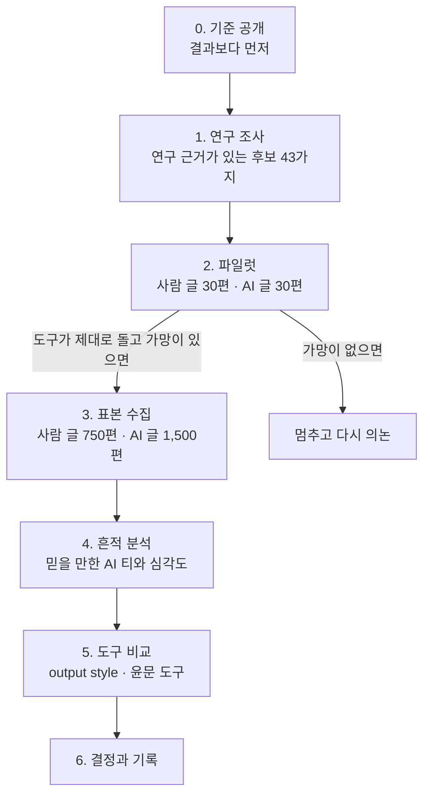

# 한국어 AI 글 비교 분석

> **한 줄 요약:** 사람이 쓴 글과 AI 가 쓴 글을 직접 비교해 믿을 만한 AI 티가 무엇인지 가려내고, 그 기준으로 한국어 문체 도구와 윤문 도구를 비교합니다.
>
> **지금 상태 (2026-09-16):** 파일럿을 마쳤습니다. 결과를 보고 본 측정의 방식을 다시 정하는 중이며, 도구 비교 결과는 아직 없습니다.
>
> **데이터 취급:** 모은 글과 측정 결과는 어떤 모델의 학습에도 쓰지 않았고 앞으로도 쓰지 않습니다. 사람이 쓴 글은 저작권이 원작자에게 있으므로 저장소에 올리지 않고 출처 주소와 게시일만 남깁니다.

## 목차

- [한눈에 보기](#한눈에-보기)
- [1. 왜 이 분석을 하나](#1-왜-이-분석을-하나)
  - [AI 티 목록은 대부분 근거가 약합니다](#ai-티-목록은-대부분-근거가-약합니다)
  - [사람 글을 AI 글로 잘못 잡으면 해롭습니다](#사람-글을-ai-글로-잘못-잡으면-해롭습니다)
  - [글을 고치다가 뜻이 사라진 일이 실제로 있었습니다](#글을-고치다가-뜻이-사라진-일이-실제로-있었습니다)
  - [예전 측정 방법이 잘못돼 있었습니다](#예전-측정-방법이-잘못돼-있었습니다)
- [2. 무엇을 정하려는가](#2-무엇을-정하려는가)
- [3. 어떻게 하나](#3-어떻게-하나)
  - [표본을 이렇게 모으는 이유](#표본을-이렇게-모으는-이유)
  - [판정 기준](#판정-기준)
- [4. 지금까지 알아낸 것 (1단계 연구 조사)](#4-지금까지-알아낸-것-1단계-연구-조사)
- [5. 비교 대상](#5-비교-대상)
- [6. 한계](#6-한계)
- [7. 결과는 언제, 어디서 보나](#7-결과는-언제-어디서-보나)
- [용어 풀이](#용어-풀이)

## 한눈에 보기

| 질문 | 답 |
| --- | --- |
| 무엇을 정하려고 하나 | ① 믿을 만한 AI 티 목록과 그 심각도 ② 함께 켜 둘 한국어 output style ③ 이 플러그인에 넣을 윤문 도구 |
| 왜 하나 | 널리 퍼진 AI 티 목록은 대부분 연구 근거가 약하고, 사람 글을 AI 글로 잘못 잡거나 글을 고치다 뜻을 잃는 문제가 실제로 있었기 때문 |
| 어떻게 하나 | 누가 썼는지 확실한 사람 글 750편과 같은 주제의 Claude 글 1,500편에서 흔적을 세고, 뜻 손실과 AI 티로 도구를 비교 |
| 무엇이 기준인가 | 흔적은 사람 글에서 한 편도 나오지 않아야 채택. 도구는 뜻 손실 0건이 먼저, 그다음 AI 티, 그다음 명확성 |
| 지금 어디까지 왔나 | 파일럿을 마침. 흔적 하나로는 사람 글과 AI 글을 가르지 못해 본 측정 방식을 다시 정하는 중 |

## 1. 왜 이 분석을 하나

이 플러그인이 하려는 일은 Claude 가 쓰는 한국어를 **뜻은 그대로 두면서 AI 티가 덜 나게** 만드는 것입니다. 그러려면 두 가지 답이 먼저 있어야 합니다. 무엇이 AI 티인지, 그리고 어떤 도구가 뜻을 지키면서 그것을 줄이는지입니다. 지금은 둘 다 믿을 만한 답이 없습니다. 이유는 네 가지입니다.

### AI 티 목록은 대부분 근거가 약합니다

「AI 는 쉼표를 많이 쓴다」, 「번역투를 쓴다」 같은 목록이 널리 쓰이지만, 사람 글과 실제로 비교한 연구가 뒷받침하는 항목은 많지 않습니다. 그래서 이 분석은 **심사를 거친 논문과 국립국어원 간행물이 보고한 특징에서만** 후보를 뽑았고, 모두 43가지가 나왔습니다. 그중 한국어 AI 글과 사람 글을 직접 비교한 심사 연구는 두 편뿐이었습니다. 널리 알려진 줄표, 복수형 `-들`, 「A가 아니라 B」 대구는 이 기준에 맞는 연구를 찾지 못해 후보에서 뺐고, `~를 통해` 처럼 번역투라는 통념과 달리 원래 한국어로 쓴 기사에 더 많이 나온 표현도 있었습니다(아래 4절).

### 사람 글을 AI 글로 잘못 잡으면 해롭습니다

영어 AI 탐지기가 비원어민이 쓴 글을 AI 글로 잘못 분류했다는 연구가 있습니다([Liang 외 2023](https://arxiv.org/abs/2304.02819)). 근거가 약한 목록으로 판정하면 평범한 사람의 글이 AI 글로 몰릴 수 있습니다.

### 글을 고치다가 뜻이 사라진 일이 실제로 있었습니다

이 플러그인의 예전 검사 훅은 「이 표현을 고쳐라」라고 알렸고, 그 안내대로 고친 글에서 원래 있던 내용이 빠졌습니다.

- 옛 안내대로 고친 대조 글 6편에서 정보 9건이 사라졌습니다([EVALUATION.md](../../EVALUATION.md) I절).
- 다른 대조 글 6편은 모두 「결론적으로」 같은 잇는 말이나 주어가 빠졌습니다(같은 문서 O절).

AI 티를 줄이는 것보다 뜻을 지키는 것이 먼저라는 기준은 여기서 나왔습니다.

### 예전 측정 방법이 잘못돼 있었습니다

2026-09-14 에 한 측정은 사람이 쓴 글인지를 파일 수정 연도로 짐작했고, 합격선을 결과를 본 뒤에 정했습니다. 그래서 이번에는 누가 썼는지 확실한 글을 쓰고, 기준을 결과보다 먼저 공개합니다.

## 2. 무엇을 정하려는가

분석이 끝나면 세 가지를 정합니다.

| 정할 것 | 어디에 쓰나 |
| --- | --- |
| 믿을 만한 AI 티 목록과 심각도 | 글을 검사하는 분석 도구의 기준이자 도구를 비교하는 잣대 |
| 함께 켜 둘 한국어 output style | 평소 답변과 처음 쓰는 글의 문체 |
| 이 플러그인에 넣을 윤문 도구 | 이미 쓴 글을 고치는 기능 |

도구를 비교할 때의 목표는 두 가지이고, **첫째가 둘째보다 앞섭니다.**

1. **의미가 절대 손실되지 않는 명확한 한국어**
2. **번역체 교정과 AI 표현 최소화**

뜻을 하나라도 잃은 도구는 AI 티가 아무리 적어도 채택하지 않습니다.

## 3. 어떻게 하나

| 단계 | 하는 일 | 왜 이렇게 하나 | 상태 |
| --- | --- | --- | --- |
| 0. 기준 공개 | 표본, 판정 기준, 비교 순서를 [분석 계획 문서](korean-ai-writing-signals.md)에 먼저 적습니다 | 결과를 보고 기준을 고르면 원하는 결론에 맞춘 숫자가 나오기 때문입니다 | 끝남 |
| 1. 연구 조사 | 심사를 거친 논문과 국립국어원 간행물에서 사람 글과 비교해 차이가 보고된 특징만 후보로 모으고, 원문으로 확인해 근거 등급을 매깁니다 | 널리 퍼진 목록이나 도구 문서를 그대로 믿지 않기 위해서입니다. 실제로 검색 결과 요약이 원문과 다른 경우가 있었습니다 | 끝남 |
| 2. 파일럿 | 사람 글 30편과 AI 글 30편으로 수집부터 계산까지 한 번 돌립니다 | 큰 비용을 쓰기 전에 도구가 맞게 도는지, 쓸 만한 흔적이 남을 가망이 있는지 봅니다 | 끝남(7절) |
| 3. 표본 수집 | 사람 글 750편 이상과 같은 주제의 Claude 글 1,500편을 모읍니다 | 아래 「표본을 이렇게 모으는 이유」에 있습니다 | 대기 |
| 4. 흔적 분석 | 43가지 흔적을 두 묶음에서 세고 심각도를 계산합니다 | 사람이 감으로 정하던 심각도를 숫자로 정하기 위해서입니다 | 대기 |
| 5. 도구 비교 | 같은 요청과 같은 원문을 도구마다 넣고 뜻 손실, AI 티, 명확성을 잽니다 | 기능 목록이 아니라 실제로 나온 글로 비교하기 위해서입니다 | 대기 |
| 6. 결정과 기록 | 무엇을 채택했고 왜 그렇게 정했는지 이 문서에 적습니다 | 나중에 결정을 다시 볼 때 근거를 따라갈 수 있게 하기 위해서입니다 | 대기 |

사람은 세 번 확인합니다. 모은 글의 목록이 정해졌을 때, 파일럿이 끝났을 때, 본 측정이 끝났을 때입니다. 본 측정의 비용은 파일럿 결과로 견적을 낸 뒤에 승인받습니다.

### 표본을 이렇게 모으는 이유

| 선택 | 이유 |
| --- | --- |
| 사람 글은 2022년 11월 30일 이전 글만 | ChatGPT 가 처음 공개된 날짜입니다. 그 전의 글에는 AI 글이 섞였을 가능성이 거의 없습니다 |
| 위키백과, 기업 기술 블로그, 개인 블로그 | 이 플러그인이 다루는 설명문·기술 문서에 가까운 글과, 편집을 거치지 않은 평범한 개인 글을 함께 보려는 것입니다 |
| AI 글은 사람 글과 같은 주제로 | 주제가 다르면 흔적의 차이가 사실은 주제의 차이일 수 있습니다. 윤문 도구 im-not-ai 의 대조 측정도 이 한계를 스스로 적었습니다 |
| AI 글은 Claude(Opus 5, Sonnet 5)로만 | 이 플러그인이 다루는 것이 Claude Code 가 쓰는 글이기 때문입니다 |
| 사람 글 750편 이상 | 절반은 흔적을 고르는 데, 절반은 확인하는 데 씁니다. 확인용 사람 글이 299편 이상이어야 「사람 글을 잘못 잡을 확률이 1% 이하」라고 95% 확신할 수 있습니다 |

### 판정 기준

- **믿을 만한 흔적:** 사람 글에서는 한 편도 나오지 않고, 그 흔적으로만 잡히는 AI 글이 한 편 이상일 것.
- **도구 순위:** ① 뜻 손실이 0건인 도구만 남기고, ② AI 티가 적은 순으로 세우고, ③ 같으면 문장이 더 명확한 쪽을 앞에 둡니다.
- **뜻 손실을 재는 법:** 원문이나 요청에 담긴 사실을 목록으로 미리 만들고, 결과 글에서 사라지거나 바뀐 사실과 빠진 문장 성분을 셉니다. Claude 가 판정하고, 일부는 사람이 원문과 대조합니다.

## 4. 지금까지 알아낸 것 (1단계 연구 조사)

아래는 **다른 연구자들이 발표한 결과**입니다. 이 플러그인이 직접 잰 결과가 아닙니다.

후보는 동료 심사를 거친 논문과 국립국어원 간행물이 사람 글과 비교해 차이를 보고한 특징에서만 뽑았습니다. 심사 전 논문, 도구 문서, 자체 측정은 참고만 하고 후보를 만드는 데 쓰지 않았습니다. 근거의 종류에 따라 등급을 붙였습니다.

| 등급 | 뜻 |
| --- | --- |
| A | 한국어 AI 글(또는 AI 를 활용해 쓴 한국어 글)과 사람 글을 비교한 심사 연구 |
| B | 영어나 일본어에서 AI 글과 사람 글을 비교한 심사 연구, 또는 기계 번역을 고친 글과 사람 번역을 비교한 심사 연구 |
| C | 사람이 번역한 한국어와 원래 한국어로 쓴 글을 비교한 코퍼스 연구 |

43가지 후보는 여섯 묶음으로 나뉩니다. 전체 목록과 출처 원문은 [분석 계획 문서의 표](korean-ai-writing-signals.md#52-후보-패턴과-근거-상태)에 있습니다.

| 묶음 | 후보 수 | 예 |
| --- | --- | --- |
| 문장부호와 표기 | 7 | 쉼표가 든 문장의 비율, 쉼표의 위치, 띄어쓰기 규칙 준수도 |
| 어휘 | 3 | 어휘 다양도, 어휘 밀도, 과하게 쓰는 스타일 어휘 |
| 품사와 문법 형태 | 13 | 품사 조합의 다양성, 명사화, 대명사, `-의`, `은/는` 과 `이/가` 의 비 |
| 문장 구조 | 7 | 평균 문장 길이, 문장 길이의 고르기, 문장당 절 수 |
| 양태와 담화 | 8 | 확신 정도를 드러내는 표현, 접속사의 종류, 감정 표현 |
| 번역투 어휘 | 5 | `대하다`·`가지다`, 피동 표현, `~통하다` |

대표적인 흔적은 다음과 같습니다.

| 흔적 | 등급 | 알려진 것 |
| --- | --- | --- |
| 쉼표를 많이 찍음 | A | 한국어 에세이에서 쉼표가 든 문장이 사람 글 26%, AI 글 61%였습니다. 시와 논문 초록에서도 AI 글이 높았습니다 |
| 띄어쓰기를 너무 규칙대로 함 | A | AI 글은 띄어쓰기 규칙을 엄격하게 지키고 사람은 가끔 띄어쓰기를 생략합니다. 다만 시나 논문 초록에서는 이 흔적으로 구별하는 힘이 크게 떨어졌습니다 |
| 품사 조합이 단조로움 | A | 한국어 에세이, 시, 논문 초록에서 사람 글의 품사 조합이 더 다양했습니다. 시의 긴 품사 조합(4·5개 연속)만 예외였습니다 |
| 문장이 짧고 어휘가 좁음 | A | AI 를 활용한 대학생 과제물은 AI 없이 쓴 과제물보다 문장이 짧고 어휘 다양성이 낮았습니다. 예시·강조 접속사가 많고 조건 접속사가 적었습니다 |
| 명사화를 많이 씀 | B | 영어 AI 글은 사람 글보다 명사화를 1.5~2배 썼습니다 |
| 확신 정도를 드러내는 표현이 적음 | B | 영어 에세이에서 사람이 AI 보다 이런 표현(인식 표지)을 더 많이 썼습니다 |
| `~를 통해` 를 많이 씀 | C | 오히려 **원래 한국어로 쓴 기사가 번역 기사보다 두 배** 많이 썼습니다. 번역투라는 통념과 반대입니다 |
| 대명사를 많이 씀 | B, C | 영어 뉴스에서는 AI 글이 대명사를 더 썼고, 영어를 옮긴 한국어 번역문에서는 2·3인칭 대명사가 많고 1인칭이 적었습니다 |

**연구끼리 방향이 엇갈리는 후보도 있습니다.** 예를 들어 어휘 다양도는 GPT-3 가 쓴 영어 에세이에서 사람보다 낮았지만 GPT-4 가 쓴 에세이에서는 높았습니다. 이런 후보는 방향을 미리 정하지 않고 이번 표본에서 잰 방향을 따릅니다.

**후보에서 뺀 것.** 널리 알려졌거나 이 플러그인의 검사 훅이 쓰는 표현이지만, 위 기준에 맞는 연구를 찾지 못했습니다. 뺐다고 해서 AI 티가 아니라는 뜻은 아니고, 연구 근거가 아직 없다는 뜻입니다.

| 뺀 것 | 이유 |
| --- | --- |
| 줄표(—)를 많이 씀 | 모델들을 잰 심사 전 자료만 있고, 그 초록에는 사람 글과의 비교가 없습니다 |
| 「A가 아니라 B」 대구 | 윤문 도구 im-not-ai 가 직접 잰 결과만 있고 심사받은 연구는 찾지 못했습니다 |
| 복수형 `-들` 을 많이 붙임 | AI 글을 잰 연구를 찾지 못했습니다. 사람이 영어 소설을 번역할 때도 사물을 가리키는 복수 명사에는 `-들` 을 거의 붙이지 않았습니다(6.8%) |
| `되어진다` 같은 이중 피동 | 빈도를 비교한 연구를 찾지 못했습니다 |
| 검사 훅의 나머지 규칙(추상 구조어, `혁신적` 같은 평가 수식, 의인화) | 사람 글과 비교한 연구를 찾지 못했습니다 |

이 조사로 알게 된 것은 두 가지입니다.

- **흔히 AI 티라고 부르는 것 중 상당수는 근거가 약하거나 없습니다.** 그래서 널리 퍼진 목록을 그대로 쓰지 않고, 연구에서 나온 후보를 파일럿과 4단계에서 직접 잽니다.
- **한국어 AI 글을 다룬 심사 연구는 두 편뿐이고, 에세이·시·논문 초록과 대학생 과제물만 다뤘습니다.** 나머지 근거는 영어·일본어 AI 글이나 한국어 번역문을 다룬 연구입니다. 설명문이나 블로그 글을 쓴 Claude 의 한국어에서도 같은 방향이 나오는지는 이번 측정으로 확인해야 합니다.

## 5. 비교 대상

2026-09-15 에 찾은 도구입니다. 측정을 시작하기 전에 더 찾으면 추가합니다. 스타 수로 순위를 매기지 않고 모두 같은 방법으로 잽니다.

**평소 답변 문체(output style)**

| 도구 | GitHub 스타 |
| --- | --- |
| [fluent-korean](https://github.com/snflkd/fluent-korean) | 1,275 |

output style 로 배포되는 한국어 플러그인은 지금까지 이것 하나를 찾았습니다.

**윤문·교정 도구**

| 도구 | GitHub 스타 |
| --- | --- |
| [k-skill](https://github.com/NomaDamas/k-skill) 의 `korean-humanizer` | 7,558 |
| [im-not-ai](https://github.com/epoko77-ai/im-not-ai) | 5,546 |
| [claude-forge](https://github.com/sangrokjung/claude-forge) 의 `humanize-korean` | 836 |
| [patina](https://github.com/devswha/patina) | 357 |
| [DaleSeo/korean-skills](https://github.com/DaleSeo/korean-skills) 의 `humanizer` | 199 |
| [korean-report-skills](https://github.com/JangHyun-bin/korean-report-skills) | 74 |
| [korean-prose-skill](https://github.com/JellyBrick/korean-prose-skill) | 20 |
| [yoonmoon](https://github.com/amondnet/yoonmoon) | 13 |
| [stop-slop-ko](https://github.com/limleesol/stop-slop-ko) | 7 |

k-skill 의 맞춤법 검사기는 외부 서비스의 이용 조건 때문에 대량 측정에서 뺍니다.

## 6. 한계

- AI 글은 Claude 로만 만듭니다. 다른 AI 의 글에서는 결과가 다를 수 있습니다.
- 뜻이 사라졌는지는 Claude 가 판정합니다. Claude 가 쓴 글을 Claude 가 채점하는 구조라서 일부는 사람이 원문과 대조합니다.
- 위키백과와 기업 블로그 글은 여러 사람이 고치거나 검토한 글이라 한 사람의 평소 문체와 다를 수 있습니다. 그래서 개인 블로그 글을 함께 넣었습니다.
- output style 플러그인을 빠짐없이 찾았다고 보장할 수는 없습니다. 어떻게 찾았는지는 분석 계획 문서에 적었습니다.
- 사람 글에서 한 편도 나오지 않는 흔적이 거의 없을 수도 있습니다. 그렇게 나오면 그 결과도 그대로 공개합니다.

## 7. 결과는 언제, 어디서 보나

### 파일럿 결과 (2026-09-16)

사람 글 30편과 Claude 글 30편으로 수집부터 비교까지 한 번 돌렸습니다. 수치와 계산 방법은 [분석 계획 문서의 11절](korean-ai-writing-signals.md#11-파일럿-결과)에 있습니다.

- **장비는 끝까지 돌았습니다.** 도중에 결함 세 가지(수집 중단, 제목 자름, 괄호를 문장부호로 세지 않음)를 찾아 비교하기 전에 고쳤습니다.
- **흔적 하나로는 가르지 못했습니다.** 「사람 글에서는 나오지 않는 값」으로 AI 글을 잡는 방식은, 사람 글과 AI 글의 표시를 무작위로 섞었을 때와 결과가 비슷했습니다.
- **글 길이를 맞추면 남는 차이가 적었습니다.** Claude 글은 요청한 분량보다 짧게 나왔습니다(30편 중 29편이 목표의 ±20% 밖). 사람 글을 같은 길이로 잘라 다시 비교하자 뚜렷한 차이는 어휘 다양도 하나만 남았고, 연구 결과와 달리 Claude 글 쪽이 더 다양했습니다.
- **그래서 본 측정은 아직 시작하지 않았습니다.** 글 분량을 맞추는 방법과 여러 흔적을 합쳐 판정하는 방식을 먼저 정합니다.

### 본 측정 결과

본 측정이 끝나면 어느 흔적이 믿을 만했는지, 어느 도구가 어떤 점에서 나았는지, 이 플러그인이 무엇을 채택했고 왜 그렇게 정했는지를 이 문서에 적습니다.

자세한 기준, 계산 방법, 출처 원문은 [분석 계획 문서](korean-ai-writing-signals.md)에 있습니다.

## 용어 풀이

| 용어 | 뜻 |
| --- | --- |
| AI 티 | AI 가 쓴 글에서 사람 글보다 자주 나타나는 표현이나 습관 |
| output style | Claude Code 가 모든 답변에 적용하는 말투 설정 |
| 윤문 | 이미 쓴 글의 뜻은 그대로 두고 표현을 다듬는 일 |
| 번역투 | 외국어를 옮기며 생긴, 우리말답지 않은 표현 |
| 기준 공개(사전 등록) | 결과를 보기 전에 판정 기준을 먼저 적어 두는 일 |
| 파일럿 | 본 측정 전에 작은 규모로 해 보는 시험 |
| 심사 | 논문을 발표하기 전에 다른 전문가가 검토하는 과정 |
